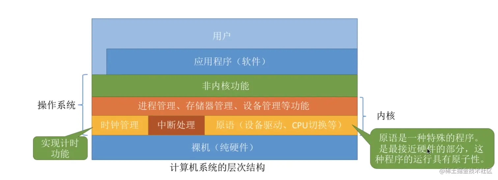
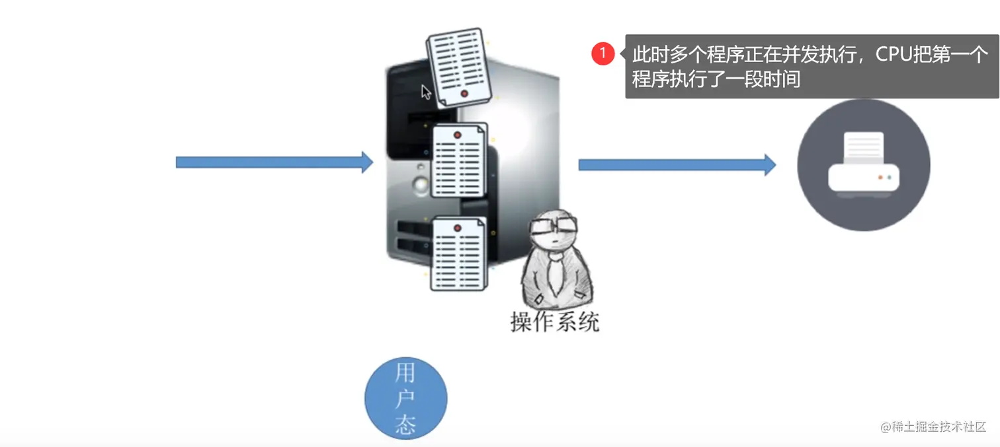
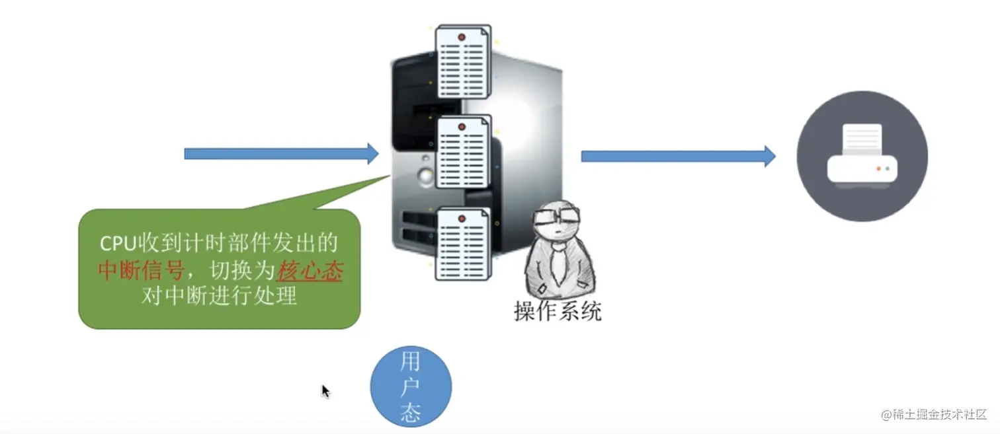
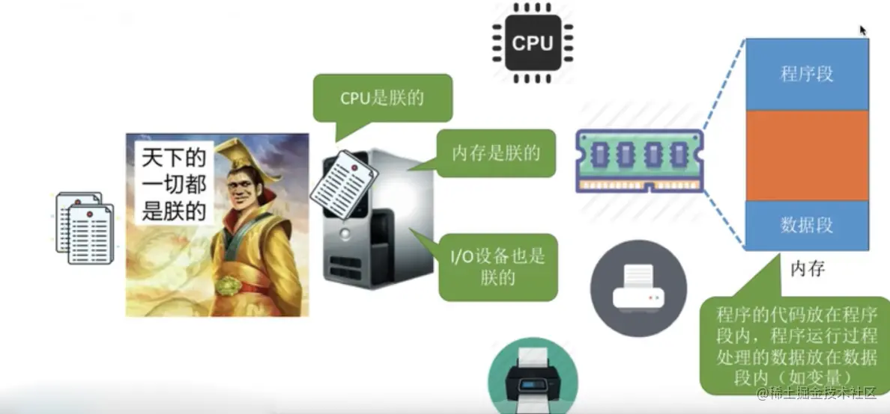
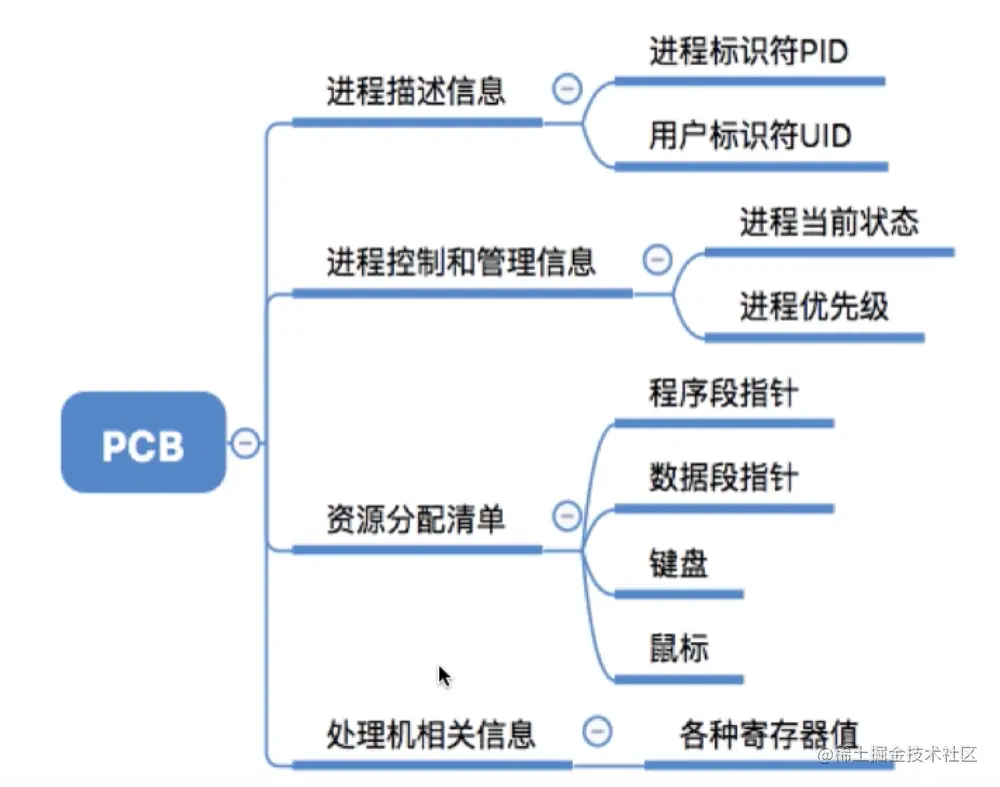
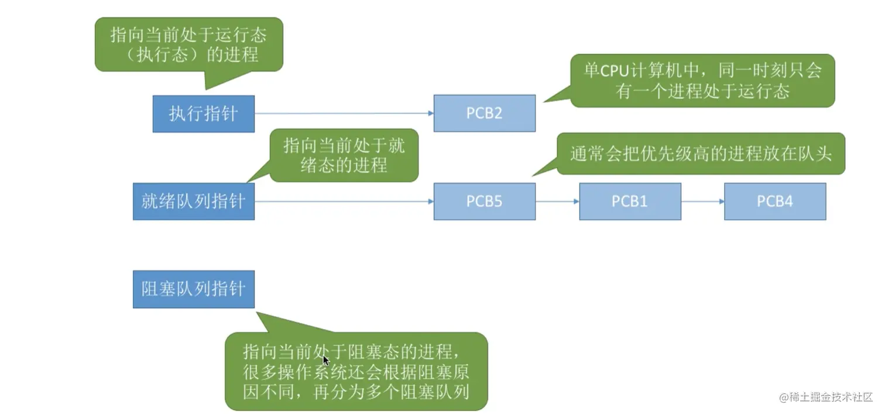
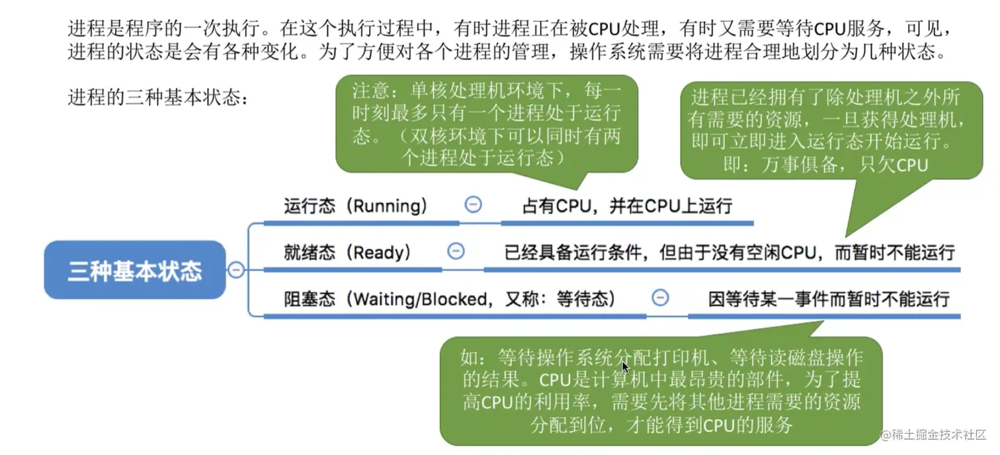
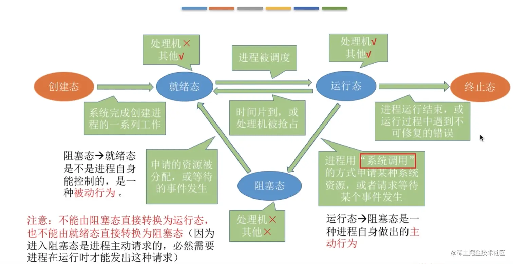

# 【前端的后端知识体系】- 操作系统 - 入门篇

### 弱弱的问一问: 要操作系统干嘛？
这里先不讲`操作系统`的概念了，因为文字太生硬了，我们只需要看一个简单的例子：

- 在我们的JS代码里，只需要输入 `console.log(1+1)`; 就可以在浏览器面板中看到`2`，这其中发生了什么事情呢?(简单扫一眼)
- 首先键盘输入代码`1+1`到显示器输出`2`, 需要`CPU`控制键盘（输入设备） ，将获取的`1+1`指令放入内存
- 然后CPU的控制器从内存中取出指令，并分析出指令是让计算机做一个`1+1`的加法运算
- 此时CPU的控制将控制CPU的运算器做`1+1`的加法运算，并得出结果`2`
- 最后CPU控制器控制运算器将结果返给内存，内存也在CPU控制器的控制下，将结果`2`返回给屏幕（输出设备）

好了，这里问题是，如果没有操作系统，一个简单的1+1运算，你的js代码还需要考虑这些硬件的协调工作，比如你的代码要协调CPU资源什么时候读取你的代码，什么时候把进程切换到别的进程。。。这些脏活累活都是操作系统帮你屏蔽了，要不这代码可咋写啊。。。


### 弱弱的问一问: 前端学这个干嘛？

很早以前看朴零大神的《深入浅出NodeJS》的时候，讲到进程间通信，有一句大概说，windows平台进程间通信用的是管道，linux平台用的是domain socket，我一看就傻眼了，啥是进程间通信？啥是管道？啥是domain socket？😭 看不懂啊....  这些都是跟操作系统进程的知识相关）。

啥也了不说了，兄弟，学习的小车已经粗发了！


### 2、操作系统运行机制和体系结构

预备知识： 什么是指令（更详细内容请看我的计算机组成原理文章）

比如说，如下图（简单扫一下即可）：


a+b是一段程序代码，a+b在CPU看来并不能一步完成，可以翻译成如下：
```
// 意思是将内存的16号单元数据，放到A寄存器，
LOAD A, 16
// 意思是将内存的16号单元数据，放到B寄存器
LOAD B, 17
// 存器里的A,B数据相加，得到C
ADD C, A, B
```
这里就可以看得出来，指令是`CPU`能`识别`和`执行`的最基本命令。

#### 2.1 两种指令、两种处理器状态、两种程序

假如说一个用户可以随意把服务器上的所有文件删光，这是很危险的。所以有些指令普通用户是不能使用的，只能是`权限较高`的用户能使用。此时指令就分为了两种，如下图：


这就引出一个问题：CPU`如何判断`当前是否可以执行`特权指令`？
如下图:

CPU通常有两种工作模式即：`内核态`和`用户态`，而在PSW（这个不用管，就知道有一个寄存器的标志位0表示用户态，1表示核心态）中有一个二进制位控制这两种模式。


对于应用程序而言，有的程序能执行特权指令，有的程序只能执行非特权指令。所以操作系统里的程序又分为两种：


#### 2.2 操作系统内核简单介绍

从下图，我们先看看操作系统内核包含哪些



操作系统内核中跟硬件紧密相关的部分有：
- 时钟管理。操作系统的时钟管理是依靠`硬件定时器`的（具体硬件怎么实现我也不太清楚，好像是靠硬件周期性的产生一个脉冲信号实现的）。时钟管理相当重要，比如我们`获取时间信息`，`进程切换`等等都是要依靠时钟管理。
- 中断处理（下一小节会详细介绍）。
- 原语（后面会有案例提到）。现在可以简单理解为用来实现某个特定功能，在执行过程中`不可被中断`的指令集合。原语有一个非常重要的特性，就是原子性（其运行`一气呵成，不可中断`）。

#### 2.3 中断

- 在程序运行过程中，系统出现了一个必须由CPU立即处理的情况，此时，CPU`暂时中止程序的执行`转而`处理这个新的情况`的过程就叫做`中断`。
下面举一个例子：


第一个应用程序在用户态执行了一段时间后

接着操作系统切换到核心态，处理中断信号

- 操作系统发现`中断的信号`是第一个程序的时间片（每个程序不能一直执行，CPU会给每个程序一定的执行时间，这段时间就是时间片）用完了，应该换第二个应用程序执行了
- 切换到`第2个进程`后，操作系统会将`CPU`的`使用权`交换给第二个应用程序，接着第二个应用程序就在`用户态`下开始执行。
- `进程`2需要调用`打印机资源`，这时会执行一个`系统调用`（后面会讲系统调用，这里简单理解为需要操作系统进入核心态处理的函数），让操作系统进入核心态，去调用打印机资源
- 打印机开始工作，`此时进程2`因为要等待打印机启动，操作系统就不等待了（等到打印机准备好了，再回来执行程序2），直接切换到`第三个应用程序`执行
- 等到打印机准备好了，此时打印机通过I/O控制器会给操作系统发出一`个中断信号`，操作系统又进入到核心态，发现这个中断是因为`程序2`等待打印机资源，现在打印机准备好了，就切换到`程序2`，切换到`用户态`，把CPU给程序2继续执行。

好了，现在可以给出一个结论，就是用户态、核心态之间的切换是怎么实现的?

- "用户态 ---> 核心态"是通过中断实现的。`并且中断时唯一途径`。
- "核心态 ---> 用户态"的切换时通过执行一个特权指令，将程序状态的标志位设为用户态。


#### 2.4 中断的分类
举一个例子，什么是内中断和外中断：

接着说之前的范桶同学，小时候不爱学习，每次学习着学习着突然异想天开，回过神来已经过好好长一段时间，这是`内部中断`。想着想着老师走过来，给了范捅一嘴巴，这是`外部中断`。

官方解释如下：

- 内中断常见的情况如`程序非法操作`(比如你要拿的的数据的内存地址不是内存地址，是系统无法识别的地址)，`地址越界`(比如系统给你的程序分配了一些内存，但是你访问的时候超出了你应该访问的内存范围)、`浮点溢出`(比如系统只能表示1.1到5.1的范围，你输入一个100, 超出了计算机能处理的范围)，或者`异常`，`陷入trap`（是指应用程序请求系统调用造成的，什么是系统调用，后面小节会举例讲）。
- 外中断常见的情况如`I/O中断`（由I/O控制器产生，用于发送信号通知操作完成等信号，比如进程需要请求打印机资源，打印机有一个启动准备的过程，准备好了就会给CPU一个I/O中断，告诉它已经准备好了）、`时钟中断`（由处理器内部的计时器产生，允许操作系统以一定规程执行函数，操作系统每过大约15ms会进行一次线程调度，就是利用时钟中断来实现的）。

#### 2.5 系统调用

>为什么需要系统调用？

- 比如你的程序需要`读取文件信息`，可读取文件属于`读取硬盘里的数`据，这个操作应该时CPU在`内核态`去完成的，我们的应用程序怎么让CPU去帮助我们切换到内核态完成这个工作呢，这里就需要`系统调用了`。

- 这里就引出系统调用的概念和作用。

- 应用程序`通过系统调用请求操作系统的服务`。系统中的各种共享资源都由操作系统统一管理，因此在用户程序中，凡是与`资源有关的操作`（如存储分配、I/O操作、文件管理等），都`必须`通过系统调用的方式向操作系统提出服务请求，由操作系统代为完成。


以下内容简单看一下即可，系统调用的分类：


需要注意的是，`库函数`和`系统调用`容易混淆。
- 库是可重用的模块 `处于用户态`
- 进程通过系统调用从用户态进入`内核态`， 库函数中有很大部分是对系统调用的封装

举个例子：比如`windows`和`linux`中，创建进程的系统调用方法是不一样的。 但在node中的只需要调用相同函数方法就可以创建一个进程。例如
```
// 引入创建子进程的模块
const childProcess = require('child_process')
// 获取cpu的数量
const cpuNum = require('os').cpus().length

// 创建与cpu数量一样的子进程
for (let i = 0; i < cpuNum; ++i) {
  childProcess.fork('./worker.js')
}
```

#### 2.6 进程的定义、组成、组织方式、状态与转换

##### 2.6.1 为什么要引入进程的概念呢？

- 早期的计算机只支持`单道程序`（是指所有进程一个一个排队执行，A进程执行时，CPU、内存、I/O设备全是A进程控制的，等A进程执行完了，才换B进程，然后对应的资源比如CPU、内存这些才能换B用）。

- 现代计算机是`多道程序`执行，就是同时看起来有多个程序在一起执行，那每个程序执行都需要系统分配给它资源来执行，比如`CPU`、`内存`。
- 拿内存来说，操作系统要知道给A程序分配的内存有哪些，给B程序分配的内存有哪些，这些都要有小本本记录下来，这个小本本就是进程的一部分，进程的一大职责就是`记录目前程序运行的状态`。
- 系统为每个运行的程序配置一个数据结构，称为`进程控制块`（PCB），用来描述进程的各种信息（比如代码段放在哪）。

##### 2.6.2 进程的定义？
简要的说，进程就是具有`独立功能的程序`在数据集合上`运行的过程`。(强调动态性)
##### 2.6.3 PCB有哪些组成

如下图，分别说明一下


-  `进程标识符PID`相当于身份证。是在进程被创建时，操作系统会为该进程分配一个唯一的、不重复的ID，`用于区分不同的进程`。
- 用户标识符`UID`用来表示这个进程`所属的用户`是谁。 
- 进程当前状态和优先级下一小节会详细介绍
- 程序段指针是指当前进程的程序在`内存的什么地方`。
- 数据段指针是指当前进程的数据在`内存的什么地方`。
- 键盘和鼠标是指进程被`分配得到的I/O设备`。
- 各种寄存器值是指比如把程序计数器的值，比如有些计算的结果算到一半，进程切换时需要把这些值保存下来。

##### 2.6.4 进程的组织
在一个系统中，通常由数十、数百乃至数千个`PCB`。为了对他们加以有效的管理，应该用适当的方式把这些PCB组织起来。这里介绍一种组织方式，类似数据结构里的链表。



##### 2.6.5 进程的状态

`进程是程序的一次执行。`在这个执行过程中，有时进程正在`被CPU处理`，有时又需要`等待CPU服务`，可见，进程的 状态是会有各种变化。为了方便对各个进程的管理，操作系统需要将进程合理地划分为几种状态。

进程的三种基本状态：





进程的另外两种状态：


##### 2.6.6 进程状态的转换
进程的状态并不是一成不变的，在一定情况下会动态转换。



以上的这些进程状态的转换是如何实现的呢，这就要引出下一个角色了，叫`原语。

- 原语是`不可被中断`的原子操作。我们举一个例子看看原语是怎么保证不可中断的。


原语采用`关中断指令`和`开中断指令`实现。

- 首先执行关中断指令
- 然后外部来了中断信号，不予以处理
- 等到开中断指令执行后，其他中断信号才有机会处理。

#### 2.6 进程的通信

>为什么需要进程间通信呢？

因为进程是`分配系统资源的单位`（包括内存地址空间），因此各进程拥有的内存地址空间相互独立。


##### 2.6.1 进程通信方法---共享存储

因为两个进程的存储空间`不能相互访问`，所以操作系统就提供的一个内存空间让彼此都能访问，这就是共享存储的原理。


其中，介绍一下基于存储区的共享。

- 在内存中画出一块`共享存储区`，数据的形式、存放位置都是由进程控制，而不是操作系统。

##### 2.6.2 进程通信方法---管道


- 管道数据是以`字符流`（注意不是字节流）的形式写入管道，当管道写满时，写进程的`write()`系统调用将被阻塞，等待读进程将数据取走。当读进程将数据全部取走后，管道变空，此时读进程的`read()`系统调用将被阻塞。
- 如果没写满就不允许读。如果都没空就不允许写。
- 数据一旦被读出，就从管道中被丢弃，这就意味着`读进程`最多只能有一个。

##### 2.6.3 进程通信方法---消息传递
进程间的数据交换以`格式化的消息`为单位。进程通过操作系统提供的`"发送消息/接收消息"`两个原语进行数据交换。

其中消息是什么意思呢？就好像你发QQ消息，消息头的来源是你，消息体是你发的内容。如下图：


接下来我们介绍一种`间接通信`的方式（很像中介者模式或者发布订阅模式）, 如下图：中介者是信箱，进程通过它来收发消息。


#### 2.7 线程

>为什么要引入线程呢？


- 比如你在玩QQ的时候，QQ是一个进程，如果QQ的进程里没有多线程并发，那么QQ进程就只能`同一时间做一件事情`（比如QQ打字聊天）
- 但是我们真实的场景是QQ聊天的同时，还可以发文件，还可以视频聊天，这说明如果QQ`没有多线程并发能力`，QQ能够的实用性就大大降低了。所以我们`需要线程`，也就是`需要进程拥有能够并发`多个事件的能力。


引入线程后带来的变化


### 3 进程的同步和互斥        


> 同步。是指多个进程中发生的事件存在某种先后顺序。即某些进程的执行必须先于另一些进程。

比如说`进程A`需要从缓冲区读取`进程B`产生的信息，当缓冲区为空时，`进程B`因为读取不到信息而被阻塞。而当`进程A`产生信息放入缓冲区时，`进程B`才会被唤醒。概念如图1所示。


>互斥。是指多个进程不允许同时使用同一资源。当某个进程使用某种资源的时候，其他进程必须等待。

比如`进程B`需要访问打印机，但此时`进程A`占有了打印机，`进程B`会被阻塞，直到`进程A`释放了打印机资源,进程B才可以继续执行。概念如图3所示。


#### 3.1 信号量（了解概念即可）

`信号量`主要是来解决进程的`同步`和`互斥`的，我们前端需要了解，如果涉及到同步和互斥的关系（我们编程大多数关于流程的逻辑问题，本质不就是同步和互斥吗？）


在操作系统中，常用`P、V信号量`来实现进程间的`同步`和`互斥`，我们简单了解一下一种常用的信号量，`记录型信号量`来简单了解一下信号量本质是怎样的。（c语言来表示，会有备注）

```C
/*记录型信号量的定义*/
typedef struct {
    int value; // 剩余资源
    Struct process *L // 等待队列
} semaphore
```
意思是信号量的结构有两部分组成，`一部分是剩余资源value`，比如目前有两台打印机空闲，那么剩余资源就是2，谁正在使用打印机，剩余资源就减1。

`Struct process *L `意思是，比如2台打印机都有人在用，这时候你的要用打印机，此时会把这个打印机资源的请求放入阻塞队列，L就是阻塞队列的地址。

```
/*P 操作，也就是记录型信号量的请求资源操作*/
void wait (semaphore S) {
    S.value--;
    if (S.value < 0){
        block (S.L);
    }
}
```
需要注意的是，如果剩余资源数不够，使用block原语使进程从运行态进入阻塞态，并把挂到信号量S的等待队列中。
```
/*V 操作，也就是记录型信号量的释放资源操作*/
void singal (semaphore S) {
    S.value++;
    if (S.value <= 0){
        wakeup (S.L);
    }
}
```
释放资源后，若还有别的进程在等待这个资源，比如打印机资源，则使用wakeup原语唤醒等待队列中的一个进程，该进程从阻塞态变为继续态。

#### 3.2 生产者消费者问题（了解概念即可）

为什么要讲这个呢，主要是node的流的机制，本质就是生产者消费者问题，可以简单的看看这个问题如何解决。


如上图，`生产者`的主要作用是生成`一定量的数据放到缓冲区中`，然后`重复此过程`。与此同时，消费者也在`缓冲区消耗这些数据`。该问题的关键就是要保证生产者不会在缓冲区满时加入数据，消费者也不会在缓冲区中空时消耗数据。

这里我们需要两个同步信号量和一个互斥信号量
```
// 互斥信号量，实现对缓冲区的互斥访问
semaphore mutex = 1;
// 同步信号量，表示目前还可以生产几个产品
semaphore empty = n;
// 同步信号量，表示目前可以消耗几个产品
semaphore full = 0;
```

生产者代码如下

```
producer () {
    while(1) {
        // 生产一个产品
        P(empty);
        // 对缓冲区加锁
        P(mutex);
        这里的代码是生产一个产品
        // 解锁
        V(mutex);
        // 产出一个产品
        V(full);
    }
}

```

消费者代码如下

```
producer () {
    while(1) {
        // 消费一个产品
        P(full);
        // 对缓冲区加锁
        P(mutex);
        这里的代码是消费一个产品
        // 解锁
        V(mutex);
        // 消费一个产品
        V(empty);
    }
}

```


### 4 内存的基础知识和概念  

>为什么需要内存

内存是计算机`其它硬件设备`与`CPU沟通`的桥梁、中转站。程序执行前需要先放到内存中才能被CPU处理。

#### 4.1 cpu如何区分执行程序的数据在内存的什么地方

- 是通过给`内存的存储单元编址`实现的。（存储单元一般是以字节为单位）
- 如下图，内存的存储单元，就像一个酒店的房间，都有编号，比如程序一的数据都在1楼，1楼1号存储着程序里`let a = 1`这段代码。


#### 4.2 内存管理-内存空间的分配与回收

- 内存分配分为`连续分配`和`非连续分配`，连续分配是指用户进程分配的必须是`一个连续的内存空间`。


- 这里我们只讲连续分配中的`动态分区分配`。

- 什么是动态分区分配呢，这种分配方式`不会预先划分内存分区`，而是在进程装入内存时，根据进程的大小`动态地`建立分区，并使分区的大小`正好适合`进程的需要。（比如，某计算机内存大小64MB，系统区8MB，用户区56MB...，现在我们有几个进程要装入内存，如下图）


- 随之而来的问题就是，如果此时进程1使用完了，相应在内存上的数据也被删除了，那么`空闲的区域`，后面该怎么分配（也就是说随着进程退出，会有很多空闲的内存区域出现）

我们讲一种较为简单的处理方法叫`空闲分区表`法来解决这个问题。如下图，右侧的表格就是一个空闲分区表。


当很多个空闲分区都能满足需求时，应该选择哪个分区进行分配呢，例如下图，分别有`20MB`，`10MB`，`4MB`三个空闲分区块，现在`进程5`需要`4MB`空闲分区，改怎么分配呢？

我们需要按照一定的动态分区分配算法，比如有`首次适应算法`，指的是每次都从低地址开始查找，找到第一个能满足大小的空闲分区。还有比如`最佳适应算法`，指的是从空闲分区表中找到最小的适合分配的分区块来满足需求。


`连续分配缺点很明显`，大多数情况，需要分配的进程大小，不能跟空闲分区剩下的大小完全一样，这样就产生很多很难利用的`内存碎片`。

这里我们介绍一种更好的空闲分区的分配方法，`基本分页存储`。如下图


将内存空间分为`一个个大小相等`的分区（比如：每个分区`4KB`）.每个分区就是一个`“页框”`。页框号从`0`开始。

将用户进程的地址空间分为与页框大小相等的一个个区域，称为`“页”`。每个页也是从`0`开始。


### 5 文件管理
>文件是什么？

文件就是一组有意义的`信息/数据`集合。


计算机中存放了各种各样的文件，一个文件有哪些属性呢？文件内部的数据应该怎样组织起来？文件之间又该怎么组织起来？

#### 5.1 文件的属性


- 文件名。即文件的名字，需要注意的是，同一目录下`不允许`有重名的文件。
- 标识符。操作系统用于区分各个文件的一种`内部的名称`。
- 类型。文件的类型。
- 位置。文件`存放的路径`，同时也是在硬盘里的位置（需要转换成物理硬盘上的地址）
- 创建时间、上次修改时间、文件所有者就是字面意思。
- 保护信息。比如对这个文件的`执行权限`，是否有删除文件权限，修改文件权限等等。

#### 5.2 文件内部数据如何组织在一起

如下图，文件主要分为`有结构文件`和`无结构文件`。


#### 5.3 文件之间如何组织起来
通过`树状结构`组织的。例如`windows`的文件间的组织关系如下：


接下来我们详细的了解一下`文件的逻辑结构`
#### 5.4 文件的逻辑结构
逻辑结构是指，在用户看来，文件内部的数据是如何组织起来的，而`“物理结构”`是在操作系统看来，文件是如何保存在外存，比如`硬盘`中的。


比如，`“线性表”`就是一种逻辑结构，在用户看来，线性表就是一组有先后关系的元素序列，如：`a,b,c,d,e....`

- `“线性表”`这种逻辑结构可以用不同的物理结构实现，比如：`顺序表/链表`。`顺序表`的各个元素在逻辑上相邻，在物理上也相邻：而`链表`的各个元素在物理上可以是不相邻的。
- 因此，顺序表可以实现`“随机访问”`，而`“链表”`无法实现随机访问。

接下来我了解一下有结构文件的三种逻辑结构

#####  5.4.1 顺序文件
>什么是顺序文件

指的是文件中的记录一个接一个地在逻辑上是`顺序排列`，记录可以是`定长`或`变长`，各个记录在物理上可以`顺序存储`或`链式存储`


- 顺序文件按结构来划分，可以分为`串结构`和`顺序结构`。
- 串结构是指记录之间的顺序与`关键字无关`，通常都是按照记录的时间决定记录的顺序。
- 顺序结构就必须保证记录之间的先后顺序按`关键字排列`。


这里需要注意的知识点是，顺序文件的存储方式和是否`按关键字排列`，会影响数据`是否支持随机存取`和`是否可以快速按关键字找到对应记录`的功能。


可以看到，顺序文件按顺序存放对于查找是非常有帮助的，我们在记录文件的时候也可以注意利用这一点。


#####  5.4.2 索引文件
对于`可变长记录文件`，要找到`第i`个记录，必须先顺序查找`前i-1`个记录（也就是需要遍历一遍），但是很多场景中又必须使用可变长记录，如何解决这个问题呢？这就引出来马上讲的`索引文件`


- 给这些变长的记录都用一张索引表来记录，一个索引表项包括了`索引号`，`长度`和`指针`。


- 其中，可以将关键字作为索引号的内容，如果关键字本身的排列是有序的，那么还可以按照关键字进行折半查找。这里是关键，因为我们平时用mysql数据库对某个字段假如索引，就是这个道理。

- 但是建立索引表的问题也很明显，首先若要`删除/增加`一个记录，同时也要对`索引表`操作，其次，如果`增加一条记录才1KB`，但是索引表`增加i一条记录可能有8KB`，以至于索引表的体积大大多于记录。存储空间的利用率就比较低。

#####  5.4.3 索引顺序文件

索引顺序文件是`索引文件`和`顺序文件`思想的结合。索引顺序文件中，同样会为文件建立一张索引表，但不同的是，并不是每个记录对应一个`索引表项`，而是一组记录对应一个索引表项。


如上图，学生记录按照学生姓名的开头字母进行分组。每个分组就是一个顺序文件，分组内的记录不需要按关键字排序

#### 5.5 文件目录

首先，我们需要了解一下`文件控制`块是什么。我们假设目前在`windows的D盘`，如下图


可以看到，目录本身就是一种`有结构的文件`，记录了目录里的`文件`和`目录`的信息，比如名称和类型。而这些一条条的记录就是一个个的`“文件控制块”（FCB）`。


文件目录的结构通常是`树状的`，例如linux里`/`是指根路径，`/home`是根路径下的二级目录


- 需要注意的是，树状目录`不容易实现文件共享`，所以在树形目录结构的基础上，增加了一些指向同一节点的有向边（可以简单理解为引用关系，就跟js里的对象一样）
- 也就是说需要为`每个共享节点`设置一个`共享计数器`，用于记录此时有多少个地方在共享该结点。只有`共享计数器减为0`，才删除该节点。

#### 文件分配方式（物理分配）

我们这里介绍一种索引分配的方式：


索引分配允许文件离散地分配在各个磁盘块中，系统会为每个文件建立一张索引表，索引表记录了文件各个逻辑块对应的物理块。索引表存放的磁盘块称为索引快。文件数据存放的磁盘块称为数据块。


如上图，假设某个新创建的文件'aaa'的数据依次存放磁盘块2->5->13>9。7号磁盘块作为’aaa‘的索引块，索引块保存了索引表的内容

#### 文件的逻辑分配和物理分配

上面我们讲到了文件的逻辑分配，是站在用户视角的分配，物理分配是站在操作系统的角度的分配，分配的是实际的物理磁盘里的空间。

举个例子，我们用户看到的文件，意识里都是顺序排列的，比如说，excel表有100行数据，用户看来这100行数据就是连续的。

在操作系统的视角，它可以把这100行数据分为一个个的数据块，比如跟磁盘块（假设磁盘块是1kb大小）一样都是1kb，拆分后的数据可以使用索引表的形式分配（也就是我们上面才讲了的，索引分配的方式，打散分配在实际的物理磁盘里）


#### 5.6 文件存储空间管理
首先，我们了解一下磁盘分为`目录区`和`文件区`。


接着，我们了解一下常见的两种`文件存储空间的管理算法`，如下图，假如硬盘上`空闲的数据块`是蓝色，`非空闲的数据`块是橙色。


对分配连续的存储空间，可以采用`空闲表法`（只讲这种较简单的方法）来`分配`和`回收`磁盘块。对于分配，可以采用首次适应，最佳适应等算法来决定要为文件分配哪个区间。（空闲表表示如下）


- `首次适应`是指当要插入数据的时候，空闲表会依次检查空闲表中的表项，然后找到`第一个满足条件`的空闲区间。

- `最佳适应算法`是指当要插入数据的时候，空闲表会依次检查空闲表中的表项，然后找到`满足条件而且空闲块最小的空闲区间`。

再讲一种位示图法

如下图：


每一个二进制位对应一个磁盘块，比如上面0表示空闲块，1表示已分配的块。而且我们可以通过一定的公式，可以从示图表的横纵坐标推断出物理块的实际地址，也可以从物理块的实际地址推断出在表里的横纵坐标。

#### 5.7 文件共享
文件共享分为两种


- 注意，多个用户`共享同一个文件`，意味着系统只有`“一份”`文件数据。并且只要某个用户修改了该文件的数据，其他用户也可以看到`文件的变化`。

- 软连接可以理解为`windows`里的`快捷方式`。

- 硬链接可以理解为js里的`引用计数`，只有引用为`0`的时候，才会真正删除这个文件。

#### 5.8 文件保护
操作系统需要保护文件的安全，一般有如下3种方式：
- 口令保护。是指为文件设置一个`“口令”`（比如123），用户请求访问该文件时必须提供对应的口令。口令一般放在文件对应的`FCB或者索引结点`上。
- 加密保护。使用某个`"密码"`对文件进行加密，在访问文件时需要提供`正确的“密码”`才能对文件进行正确的解密。
- 访问控制。在每个文件的FCB或者索引节点种增加一个`访问控制列表`，该表中记录了各个用户可以对该文件执行哪些操作。


## 总结文件系统这块的内容

我们举一个实际案例，把上面的内容总结一下。

假如我们当前的操作系统采用如下的文件系统管理方式：
- 文件的物理结构 --- 索引分配（混合索引）
- 文件目录的实现 --- inode结点
- 空闲分区管理 --- 位示图法

那么我们假设0号磁盘块就是装载位示图的磁盘块，用来管理哪些磁盘是空闲的哪些是正在使用的。


因为这里我们已经使用了0号块，位示图的第一项就是1

接着我们把磁盘块第二块用来放inode节点，也就是文件目录索引节点，意思是文件目录下存放的只有文件名和索引节点的位置，要知道文件的详细信息，就要靠着


假设2号磁盘块存放了我们根目录信息，而本身目录其实也是一种特殊的文件，也在inode节点表里有自己的信息，1号磁盘块增加类似如下信息：

```
类型：目录
存放在：2号磁盘块
```

2号磁盘块里面存放了一个`你好.txt`文件，那么2号磁盘块会增加一行信息，类似

```
文件名：你好.txt
inode结点：2
```
这就意味着，2号inode节点存放了你好.txt文件的具体磁盘块在哪，所以在1号磁盘块的2号inode节点增加
```
类型：txt
存放在：3、4号磁盘块
```
为什么要放到3、4号磁盘块呢，因为我们有位示图，知道哪些磁盘块是空闲的就分配给它，一扫描发现3、4正空闲而且满足存放这个文件的条件，就分配出去了。

我们在细分一下这里的3、4号磁盘块是什么意思，因为我们物理磁盘块分配的方法是混合索引，其实3、4号磁盘块表示的形式如下：

```
直接索引：3号磁盘块
直接索引：4号磁盘块
```
上面只涉及到直接索引，我们其实还可以有1级索引，2级索引，这些索引指向的是一个索引表，我们这里就不详细叙述了（之前交过索引块和索引表）。

到这里我们们就基本明白了一个文件系统的基本运行原理。

### 6 I/O设备
> 什么是I/O设备

I/O就是`输入输出`(Input/Output)的意思，I/O设备就是可以将数据输入到计算机，或者可以接收计算机输出数据的外部设备，属于计算机中的硬件部件。

#### 6.1 I/O设备分类--按使用特性

- 人机交互类设备，这类设备传输数据的速度慢


- 存储设备，这类设备传输数据的速度较快


- 网络通信设备，这类设备的传输速度介于人机交互设备和存储设备之间

#### 6.2 I/O控制器

CPU无法直接控制`I/O设备的机械部件`，因此I/O设备还要有一个电子部件作为`CPU`和`I/O设备`机械部件之间的`“中介”`，用于实现CPU对设备的控制。这个电子部件就是`I/O控制器`。


- 接收和识别CPU发出的指令是指，比如CPU发来读取文件的命令，I/O控制器中会有相应的`控制寄存器`来存放命令和参数
- 向cpu报告设备的状态是指，I/O控制器会有相应的`状态寄存器`，用来记录I/O设备`是否空闲`或者`忙碌`
- 数据交换是指I/O控制器会设置相应的`数据寄存器`。输出时，数据寄存器用于`暂存CPU发来的数据`，之后再由控制器传送给设备。
- 地址识别是指，为了区分设备控制器中的各个寄存器中的各个寄存器，也需要给各个寄存器设置一个特性的`“地址”`。I/O控制器通过CPU提供的“地址”来判断CPU要读写的是哪个寄存器

#### 6.3 I/O控制方式

- 这里我们指讲一下目前比较先进的方式，通道控制方式。

- 通道可以理解为一种`“弱鸡版CPU”`。通道可以识别并执行一系列通道指令。


通道最大的优点是极大的`减少了CPU的干预频率`，`I/O设备`完成任务，通道会向CPU发出`中断`，不需要轮询来问I/O设备是否完成CPU下达的任务。


本文完结。


注：
本文绝大多数资料来源于以下的学习视频资料
- [操作系统_清华大学（陈渝）](https://www.bilibili.com/video/av6538245?from=search&seid=6918809747167691096)
- [2019 王道考研 操作系统](https://www.bilibili.com/video/av70156862?from=search&seid=6918809747167691096)
- [操作系统（哈工大李治军老师）32讲](https://www.bilibili.com/video/av51437944?from=search&seid=6918809747167691096)