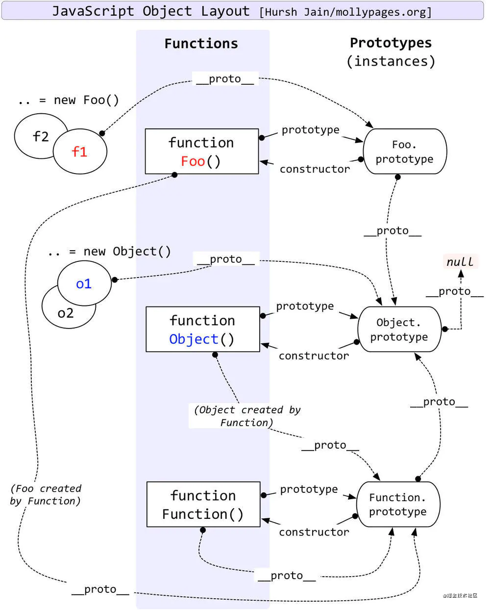

# JavaScript 基础问题

* [`[Basic]` 类型判断]
* [`[Basic]` 作用域]
* [`[Basic]` 引用传递]
* [`[Basic]` 内存释放]
* [`[Basic]` ES6 新特性]


## 简述

与前端 Js 不同, 后端方面除了SSR/爬虫之外很少会接触 DOM, 所以关于 DOM 方面的各种知识基本不会讨论. 浏览器端除了图形业务外很少碰到内存问题, 但是后端几乎是直面服务器内存的, 更加偏向内存方面, 对于一些更基础的问题也会更加关注.

## 类型判断

##### 1、typeof能够识别哪些类型？

typeof可以测试出number、string、boolean、Symbol、undefined及function，而对于null及数组、对象，typeof均检测出为object，不能进一步判断它们的类型。

##### >>> 延伸问题：typeof NaN 结果是什么？以及为什么

- 答案是number，为什么呢？因为IEEE-754标准，64位浮点数，当指数位全为1, 表示非数字(NaN Not a Number),诸如0除以0的结果。

##### >>> 延伸问题： 为什么string这种基础类型居然还能调用方法，例如'a'.indexOf('a'), 方法调用不是对象才有的能力吗？

- js中为了便于基本类型操作，提供了3个特殊的引用类型：Boolean、Number、String它们具有基本类型特殊行为。

- 实际上，每当读取一个基本类型的时候，js内部会自动创建一个基本包装类型对象，可以让我们调用一些方法来操作。

- 'a'.indexOf('a')在调用过程中会先let str = new String('a')，然后调用indexOf，调用完毕str = null, 销毁该对象

##### 如何精确判断引用类型？

Object.prototype.toString方法返回对象的类型字符串，因此可用来判断一个值的类型。

```javascript
Object.prototype.toString.call(undefined); // [object Undefined]

Object.prototype.toString.call(null); // [object Null]

Object.prototype.toString.call("这是字符串"); // [object String]

Object.prototype.toString.call(1); // [object Number]

Object.prototype.toString.call(true); // [object Boolean]

Object.prototype.toString.call({}); // [object Object]

Object.prototype.toString.call([]); // [object Array]

Object.prototype.toString.call(new Function()); // [object Function]

Object.prototype.toString.call(new Date()); // [object Date]

Object.prototype.toString.call(new RegExp()); // [object RegExp]

Object.prototype.toString.call(new Error()); // [object Error]
```
##### >>> 延伸问题：为什么要用 Object.prototype.toString，不用自己原型对象的toString方法，比如函数const a = new Function(); 调用a.toString()不行吗？
因为实例对象有可能会自定义toString方法，会覆盖Object.prototype.toString，所以在使用时，最好加上call。
## 原型和原型链

请回答这个题，如果回答正确你的原型和原型链就完全没问题了。
```JAVASCRIPT
class Foo{}
const f1 = new Foo();
```
请问：
```javascript
// 难度小
console.log(Foo.prototype.constructor === Foo) // ?
console.log(f1.__proto__ === Foo.prototype) // ?

// 难度中
console.log(Object.prototype.__proto__ === null) // ?
console.log(Function.prototype.__proto__ === Object.prototype) // ?

// 难度较大
console.log(Function.prototype === Object.__proto__) // ?
```


答案：全是true，至于为啥，可能要写一篇很长的文章了，留给大家去思索吧。（简单记忆，所有函数最终都收敛到Function.prototype，所有对象都收敛到Object.prototype，或者说null）

下图应该能解释：



## 作用域

作用域是指程序源代码中定义变量的区域。在这个区域内，变量有自己的访问权限。在javascript中，采取的是静态作用域

请看下面的案例，便知什么是静态作用域
```JAVASCRIPT
let value = 1;

function foo() {
    console.log(value);
}

function bar() {
    let value = 2;
    foo();
}

bar();
```
答案是1，因为foo中的value的作用域在书写完毕代码的时候就已经决定了，这就是静态作用域。

面试题：
```javascript
let scope = "global scope";
function checkscope(){
    let scope = "local scope";
    function f(){
        return scope;
    }
    return f();
}

checkscope();

let scope = "global scope";
function checkscope(){
    let scope = "local scope";
    function f(){
        return scope;
    }
    return f;
}
checkscope()();
```
请问输出什么？

跟作用域相关的一个话题是变量提升和函数提升，想了解面试者函数提升掌握能力可以出下题：

```javascript
function foo() {

    console.log('foo1');

}

foo();  // foo2

function foo() {

    console.log('foo2');

}

foo(); // foo2
```
请问两次foo执行输出什么，为什么？

这是因为在 JavaScript 中，函数声明会被提升到作用域的顶部，这被称为“函数提升”。因此，尽管第一个 foo() 调用在第一个函数声明之前，但第二个函数声明会覆盖第一个函数声明。当第二个 foo() 被调用时，它会输出 'foo2'。同样地，第一个 foo() 调用在第二个函数声明之前，但是第二个函数声明在全局作用域被解析，它会覆盖第一个函数声明。因此，第二个 foo() 调用也会输出 'foo2'。

## 执行上下文栈

有些人可能要说《高级程序设计》的VO，AO，对不起，这是ES3的说法。答这道题就走远了。
详细内容请看 https://juejin.cn/post/6844903682283143181

一般面试题会问，能谈下执行上下文是什么吗？let和var在执行上下文栈保存的区域有什么区别？

- 每当 JavaScript 解释器要执行我们编写的函数或脚本时，它都会创建一个新的上下文。每个脚本/代码都以一个称为全局执行上下文的执行上下文开始。每次我们调用一个函数时，都会创建一个新的执行上下文并将其放在执行堆栈的顶部。当您调用调用另一个嵌套函数的嵌套函数时，也会放在执行堆栈的顶部。

简而言之，

在全局环境中，环境记录器是对象环境记录器。
在函数环境中，环境记录器是声明式环境记录器。

抽象地讲，词法环境在伪代码中看起来像这样：
```javascript
// 全局的执行上下文
// LexicalEnvironment是指词法环境主要保存let const声明的变量
GlobalExectionContext = {
  ThisBinding = <this value>,      // this绑定
  LexicalEnvironment: {
    EnvironmentRecord: {
      Type: "Object",
      // 在这里绑定标识符
    }
    outer: <null>
  }
}

// 函数的执行上下文
// outer指向上一个执行上下文，这里是指向全局的执行上下文
FunctionExectionContext = {
  ThisBinding = <this value>,      // this绑定
  LexicalEnvironment: {
    EnvironmentRecord: {
      Type: "Declarative",
      // 在这里绑定标识符
    }
    outer: <Global or outer function environment reference>
  }
}
```
请注意，执行上下文中包含this的绑定，也就是说，this指向是在执行上下文中的，但是需要注意的是，函数的this绑定是动态的，在执行的时候才真正绑定。

我们再来看一下变量环境

```javascript
GlobalExectionContext = {
  ThisBinding: <Global Object>,
  LexicalEnvironment: {       // 词法环境
    EnvironmentRecord: {
      Type: "Object",
      // 在这里绑定标识符
      a: < uninitialized >,   // let、const声明的变量
      b: < uninitialized >,   // let、const声明的变量
      multiply: < func >      // 函数声明
    }
    outer: <null>
  },
  VariableEnvironment: {     // 变量环境
    EnvironmentRecord: {     
      Type: "Object",
      // 在这里绑定标识符
      c: undefined,         // var声明的变量
    }
    outer: <null>
  }
}
```
如上图说是，变量环境一般声明上下文栈的VariableEnvironment属性中。


以上的上下文栈你可以考察的题目参考如下：

- 请问this指向问题，然后引申一下this具体在js环境中的哪里
- 然后引出上下文栈的概念，问变量环境和词法环境有什么区别，然后继续问闭包，因为闭包跟上下文栈息息相关，为啥呢，看下文的闭包这一小节。

## 闭包

什么是闭包呢？
概念太生硬，我们举个例子来看
```typescript
const scope = "global scope";
function checkscope(){
    var scope = "local scope";
    function f(){
        return scope;
    }
    return f;
}

const foo = checkscope();
foo();
```
如上，checkscope调用完毕，从函数调用栈或者上下文栈弹出，也就是销毁了，按道理说，这个函数里的变量也都全部销毁了。

但是foo调用的时候，依然能访问到scope这个变量，这就是闭包。


简单来说就是函数已经从上下文栈弹出了，销毁了，但是依然能访问到之前销毁的变量。这样的函数就是闭包。

同时也解释了，为啥我们说闭包跟作用域链息息相关了。

面试问题参考问题:
- 之前讲了上下文栈里有一个outer属性指向上一个上下文，这样就可以形成一个作用域链，但实际上，作用域链保存在[[Scopes]]中，首先你知道[[Scopes]]是什么吗？其次为什么会保存到这里，而不是用上下文的outer去寻找。

答：如果单纯的通过 outer 链路来实现作用域链，那么存在一个闭包时，整个链条上的所有词法环境，变量环境，this指向都无法回收。其实，这么做也不是不行，那有没有更好的方案呢， V8 优化了这一点。而是通过 [[Scopes]] + Closure 解决。也就是说在编译函数时，把用到的词法环境的数据放到[[Scopes]] 的 Closure对象里，这样就不用保存整个词法环境了。

详细原理参考这篇文章：https://juejin.cn/post/7079995358624874509


来个终极闭包难度面试题,摘自上文连接，想知道原理可以进去看
```javascript
let theThing = null;
let replaceThing = function () {
    let leak = theThing;
    function unused () { 
        if (leak){}
    };

    theThing = {  
        longStr: new Array(1000000),
        someMethod: function () {  
                                   
        }
    };
};

let index = 0;
while(index < 100){
    replaceThing()
    index++;
}
```
## 引用传递

> <a name="q-value"></a> js 中什么类型是引用传递, 什么类型是值传递? 如何将值类型的变量以引用的方式传递?

简单点说, 对象是引用拷贝（引用拷贝跟引用传递有区别参考下面的案例）, 基础类型是值传递, 通过将基础类型包装 (boxing) 可以以引用的方式传递.

```javascript
function changeStuff(a, b, c)
{
  a = a * 10;
  b.item = "changed";
  c = {item: "changed"};
}

var num = 10;
var obj1 = {item: "unchanged"};
var obj2 = {item: "unchanged"};

changeStuff(num, obj1, obj2);

console.log(num);
console.log(obj1.item);
console.log(obj2.item);

// 10
// changed
// unchanged
```

引用传递和值传递是一个非常简单的问题, 也是理解 JavaScript 中的内存方面问题的一个基础. 如果不了解引用可能很难去看很多问题.

## 内存释放

> <a name="q-mem"></a> JavaScript 中不同类型以及不同环境下变量的内存都是何时释放?

引用类型是在没有引用之后, 通过 v8 的 GC 自动回收, 值类型如果是处于闭包的情况下, 要等闭包没有引用才会被 GC 回收, 非闭包的情况下，分新生代和老生代的内存区，新生代 (new space)是 切换的时候回收，老生代是标记清除。

与前端 Js 不同, 2年以上经验的 Node.js 一定要开始注意内存了, 不说对 v8 的 GC 有多了解, 基础的内存释放一定有概念了, 并且要开始注意内存泄漏的问题了.

你需要了解哪些操作一定会导致内存泄漏, 或者可以崩掉内存. 比如如下代码能否爆掉 V8 的内存?

```javaScript
let arr = [];
while(true)
  arr.push(1);
```
可以，因为数组占用的是V8的内存

然后上述代码与下方的情况有什么区别?

```javaScript
let arr = [];
while(true)
  arr.push();
```

如果 push 的是 `Buffer` 情况又会有什么区别?

```javaScript
let arr = [];
while(true)
  arr.push(new Buffer(1000));
```

思考完之后可以尝试找找别的情况如何爆掉 V8 的内存. 以及来聊聊内存泄漏?

```javaScript
function out() {
  const bigData = new Buffer(100);
  inner = function () {
    void bigData;
  }
}
```

闭包会引用到父级函数中的变量，如果闭包未释放，就会导致内存泄漏。上面例子是 inner 直接挂在了 root 上，从而导致内存泄漏（bigData 不会释放）。

对于一些高水平的同学, 要求能清楚的了解 v8 内存 GC 的机制, 懂得内存快照等 (之后会在`调试/优化`的小结中讨论) 了. 比如 V8 中不同类型的数据存储的位置, 在内存释放的时候不同区域的不同策略等等.

我可能会接着问，如何排查内存泄露呢？

## 如何排查内存泄露

详见[《如何分析 Node.js 中的内存泄漏》](https://zhuanlan.zhihu.com/p/25736931)

这篇文章分析的相当到位，主要是有很清晰的案例，让你很快就能初步掌握排查内存泄露的方法。

快照工具推荐使用 heapdump 用来保存内存快照，使用 devtool 来查看内存快照。

简单来说，就是使用heapdump.writeSnapshot，来打印内存泄露前的情况，然后对比打印前和打印后哪些变量存储的数据直线上涨，然后devtool有代码连接，就可以仔细分析具体代码了。

## ES6 新特性

推荐阅读阮一峰的 [《ECMAScript 6 入门》](http://es6.ruanyifeng.com/)

比较简单的会问 `let` 与 `var` 的区别, 以及 `箭头函数` 与 `function` 的区别等等.

深入的话, es6 有太多细节可以深入了. 比如结合 `引用` 的知识点来询问 `const` 方面的知识. 结合 `{}` 的使用与缺点来谈 `Set, Map` 等. 比如私有化的问题与 `symbol` 等等.

其他像是 `闭包是什么?` 这种问烂了问题已经感觉没必要问了, 取而代之的是询问闭包应用的场景更加合理. 比如说, 如果回答者通常使用闭包实现数据的私有, 那么可以接着问 es6 的一些新特性 (例如 `class`, `symbol`) 能否实现私有, 如果能的话那为什么要用闭包? 亦或者是什么闭包中的数据/私有化的数据的内存什么时候释放? 等等.

`...` 的使用上, 如何实现一个数组的去重 (使用 Set 可以加分).

> <a name="q-const"></a> const 定义的 Array 中间元素能否被修改? 如果可以, 那 const 修饰对象有什么意义?

其中的值可以被修改. 意义上, 主要保护引用不被修改 (如用 [Map](https://developer.mozilla.org/en/docs/Web/JavaScript/Reference/Global_Objects/Map) 等接口对引用的变化很敏感, 使用 const 保护引用始终如一是有意义的), 也适合用在 immutable 的场景.

暂时写上这些, 之后会慢慢整理, 如果内容比较多可能单独归一类来讨论.


### 补充问题

- js 中什么类型是引用传递, 什么类型是值传递? 如何将值类型的变量以引用的方式传递?

答：简单点说，对象是引用传递，基础类型是值传递，通过将基础类型boxing(包装)可以以引用方式传递。

- js 中， 0.1 + 0.2 === 0.3 是否为 true ? 在不知道浮点数位数时应该怎样判断两个浮点数之和与第三数是否相等？

这是烂大街的题目了，没啥难度，主要是理解10进制转2进制时会有误差，解决方法一般要用库，比如big.js，具体源码没看，待大家留言沟通。

- JavaScript 中不同类型以及不同环境下变量的内存都是何时释放?

值类型一般在复杂情况是闭包引用，然后只有闭包的引用全部断开才会回收。

引用类型的话，内存上分新生代和老生代。具体算法不一样，新生代是交换空间，老生代是标记清除。

具体请参考我的文章[NodeJS有难度的面试题，你能答对几个？](https://juejin.cn/post/6844903951742025736)，其中有一小节讲的是垃圾回收机制
