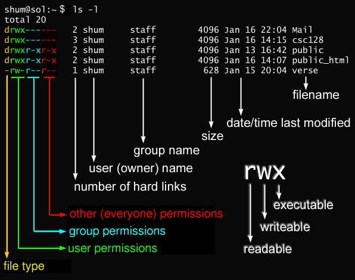
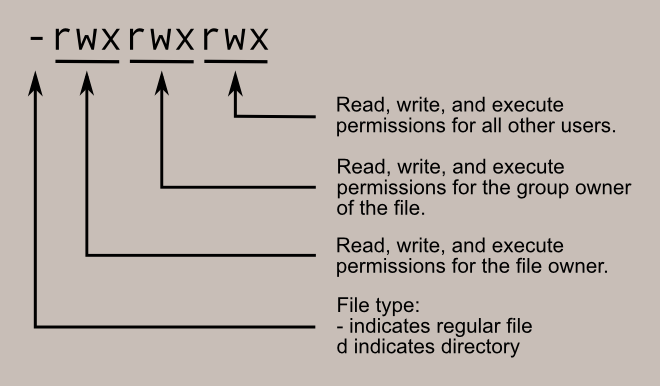
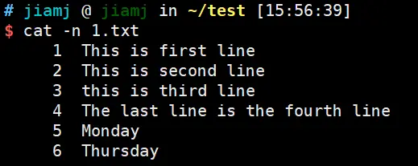
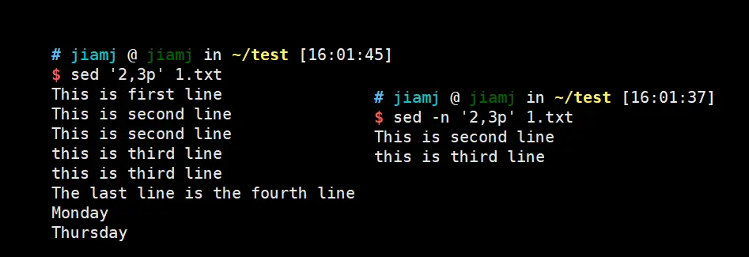
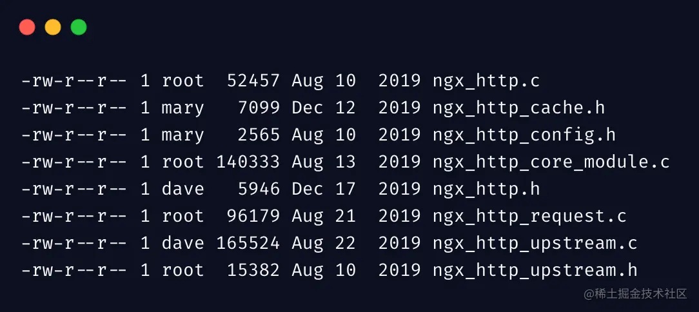
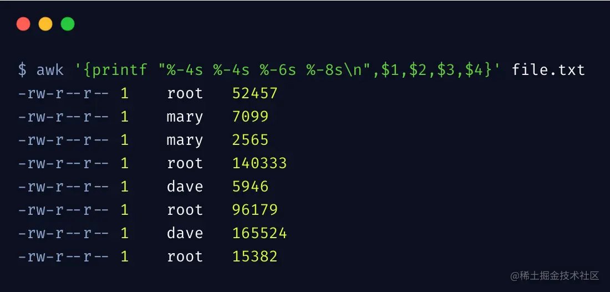
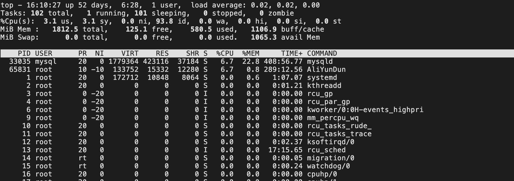
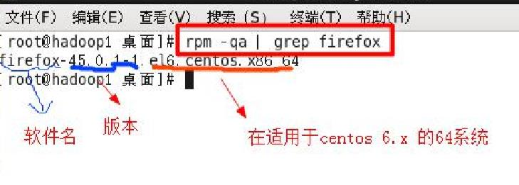

建议看视频为主，文章太枯燥了，欢迎进群交流。

## 命令行常用快捷键
- tab 补全功能 连续2下。
- ctrl+a 光标移至开头
- ctrl+e 光标移至结尾
- ctrl+u 删除光标前内容
- ctrl+k 删除光标后内容
- ctrl+c 终止当前程序
- ctrl+d 退出当前会话（logout）
- ctrl+l  清屏（clear）
- ctrl+z 暂停正在执行的程序
- esc+. 调出上一个命令最后一个【空格】后面的部分
<a name="ZaF4v"></a>
## 小试牛刀 - 几个Linux目录核心命令

- pwd: 打印当前工作路径 print work directory
- cd 切换目录 change directory
- ls: 查看目录下的内容 list directroy contents
   - -l 长格式(long) 查看内容属性

		文件和文件属性（大小，创建时间，用户，用户组，权限）

   - -a 显示所有文件
   - -d 显示目录本身

- mkdir 创建目录 make directroy 
   - -p 递归创建目录

- {1..10} 数字序列
```bash
[root~]# echo {1..10} // 1 2 3 4 5 6 7 8 9 10
```

<a name="vHGPH"></a>
# linux常用命令
<a name="AGUFM"></a>
## 常见目录
| /bin        | 存放二进制可执行文件(ls,cat,mkdir等)，常用命令一般都在这里。                                                                                                                                                                                                                                                                                                                                                                                                                                                                                                        |
| ----------- | ------------------------------------------------------------------------------------------------------------------------------------------------------------------------------------------------------------------------------------------------------------------------------------------------------------------------------------------------------------------------------------------------------------------------------------------------------------------------------------------------------------------------------------------------------------------- |
| /etc        | 存放系统管理和配置文件                                                                                                                                                                                                                                                                                                                                                                                                                                                                                                                                              |
| /home       | 存放所有用户文件的根目录，是用户主目录的基点，比如用户user的主目录就是/home/user，可以用~user表示                                                                                                                                                                                                                                                                                                                                                                                                                                                                   |
| /usr        | 用于存放系统应用程序，比较重要的目录/usr/local 本地系统管理员软件安装目录（安装系统级的应用）。这是最庞大的目录，要用到的应用程序和文件几乎都在这个目录。<br />/usr/x11r6 存放x window的目录<br />/usr/bin 众多的应用程序 <br />/usr/sbin 超级用户的一些管理程序 <br />/usr/doc linux文档 <br />/usr/include linux下开发和编译应用程序所需要的头文件 <br />/usr/lib 常用的动态链接库和软件包的配置文件 <br />/usr/man 帮助文档 <br />/usr/src 源代码，linux内核的源代码就放在/usr/src/linux里 <br />/usr/local/bin 本地增加的命令 <br />/usr/local/lib 本地增加的库 |
| /opt        | 额外安装的可选应用程序包所放置的位置。一般情况下，我们可以把tomcat等都安装到这里。                                                                                                                                                                                                                                                                                                                                                                                                                                                                                  |
| /proc       | 虚拟文件系统目录，是系统内存的映射。可直接访问这个目录来获取系统信息。                                                                                                                                                                                                                                                                                                                                                                                                                                                                                              |
| /root       | 超级用户（系统管理员）的主目录（特权阶级^o^）                                                                                                                                                                                                                                                                                                                                                                                                                                                                                                                       |
| /sbin       | 存放二进制可执行文件，只有root才能访问。这里存放的是系统管理员使用的系统级别的管理命令和程序。如ifconfig等。                                                                                                                                                                                                                                                                                                                                                                                                                                                        |
| /dev        | 用于存放设备文件。                                                                                                                                                                                                                                                                                                                                                                                                                                                                                                                                                  |
| /mnt        | 系统管理员安装临时文件系统的安装点，系统提供这个目录是让用户临时挂载其他的文件系统。                                                                                                                                                                                                                                                                                                                                                                                                                                                                                |
| /boot       | 存放用于系统引导时使用的各种文件                                                                                                                                                                                                                                                                                                                                                                                                                                                                                                                                    |
| /lib        | 存放跟文件系统中的程序运行所需要的共享库及内核模块。共享库又叫动态链接共享库，作用类似windows里的.dll文件，存放了根文件系统程序运行所需的共享文件。                                                                                                                                                                                                                                                                                                                                                                                                                 |
| /tmp        | 用于存放各种临时文件，是公用的临时文件存储点。                                                                                                                                                                                                                                                                                                                                                                                                                                                                                                                      |
| /var        | 用于存放运行时需要改变数据的文件，也是某些大文件的溢出区，比方说各种服务的日志文件（系统启动日志等。）等。                                                                                                                                                                                                                                                                                                                                                                                                                                                          |
| /lost+found | 这个目录平时是空的，系统非正常关机而留下“无家可归”的文件（windows下叫什么.chk）就在这里                                                                                                                                                                                                                                                                                                                                                                                                                                                                             |


上面有个注意事项：<br />其实，/opt目录和/usr/local目录都是安装软件的目录，那这两个目录有什么区别呢？<br />**一、opt目录**<br />/opt目录用来安装附加软件包，是用户级的程序目录，可以理解为D:/Software。安装到/opt目录下的程序，它所有的数据、库文件等等都是放在同个目录下面。opt有可选的意思，这里可以用于放置第三方大型软件（或游戏），当你不需要时，直接rm -rf掉即可。在硬盘容量不够时，也可将/opt单独挂载到其他磁盘上使用。<br />**二、/usr/local目录**<br />/usr：系统级的目录，可以理解为C:/Windows/。<br />/usr/lib：理解为C:/Windows/System32。<br />/usr/local：用户级的程序目录，可以理解为C:/Progrem Files/。用户自己编译的软件默认会安装到这个目录下。

<a name="MALUO"></a>
# 重要配置文件

- 网卡配置文件: /etc/sysconfig/network-scripts/ifcfg-eth0：
```bash
[root]# cat /etc/sysconfig/network-scripts/ifcfg-eth1 
HWADDR=00:0C:29:C4:6F:D9     #MAC地址 网卡的物理地址
TYPE=Ethernet                 #以太网
BOOTPROTO=none           #
IPADDR=10.0.0.129        #IP地址
PREFIX=24                #子网掩码
GATEWAY=10.0.0.254       #网关
DNS1=223.5.5.5           #DNS1 域名解析为IP。
DNS2=202.106.0.20        #DNS2 域名解析为IP。
NAME=eth1   #设备名
UUID=cf363dd6-05ce-37d3-8caa-242f64883a8f #唯一标识
ONBOOT=yes    #网卡随着linux开启启动 
```

- /etc/resolv.conf：Linux系统过时的DNS客户端配置文件

配置客户端DNS有两种方法;<br />1.网卡配置文件里设置（优先）<br />2.直接在/etc/resolv.conf里配置（很容易被覆盖）

- /etc/hostname：主机名配置文件

特殊知识点：linux设备 直接插上去 用不了，需要将设备挂载以后才能使用，例如
```bash
[root]# mount /dev/cdrom /mnt 
```
重启，挂载会失效。永久挂载需在在配置文件（/etc/fstab ）里配置。

- /etc/rc.local：存放开机自启动程序命令的文件
- /etc/profile、/etc/bashrc 配置系统的环境变量/别名等的文件※※※

- /usr目录的重要知识介绍 应用程序目录
   - /usr/local/：编译安装软件默认的位置路径，c:\Program files
   - /usr/src：源代码目录

日志：计算机遇到各种问题，记录日志里，告诉管理员他们的情况。

- /var目录下的路径知识 可变化的目录<br />/var/log/messages  #linux系统日志文件，系统故障可以去看看。<br />/var/log/secure    #安全日志（ssh日志记录到这里），监控日志。<br />/var/log/dmesg     #记录硬件信息加载情况的日志文件(dmesg)

- /proc下的重要路径知识 进程和内核信息的文件<br />路径名称	          路径说明<br />/proc/cpuinfo	  当前cpu信息文件<br />/proc/meminfo	  当前内存信息文件<br />/proc/loadavg	  当前系统的平均负载文件<br />/proc/mounts	  当前设备挂载列表信息文件<br />/proc/interrupts  当前系统中断信息文件

- /dev下目录知识<br />/dev/hd[a-t]IDE设备<br />/dev/sd[a-z] SCSI设备<br />/dev/null  无限数据接收设备,相当于黑洞<br />/dev/zero  无限零资源<br />/dev/cdrom 光驱


- 目录命令：<br />1）cp 复制目录<br />cp 选项  源  目标

例如:
```bash
# 复制文件：
[root]# cp /etc/hosts /tmp/ 
[root]# ls /tmp/ 

# 复制目录：
[root]# cp -r /etc /tmp/ 
[root]# ls /tmp/ 

[root]# cp -a /etc /opt 
[root]# ls /opt 
```

- 把当前目录下的dir1,移动到/tmp目录。
```bash
[roo]# mv dir1 /tmp/ 
```


- 强制删除：rm -rf a

生产慎用：<br />1.用mv替代rm,把/tmp当做回收站<br />2.find+rm 提高删除的门槛。find找到多少天，什么类型的文件，指定删除，这样比单纯rm -rf要安全

<a name="SG1ei"></a>
# 文件处理命令
文件编辑： vim命令

- VIM模式介绍

当你打开一个文件, 你会进入到nomarl模式。你可以查看文件内容，但是不能够做任何修改。此时，你可以输入i切换到insert模式。此时，你可以敲击输入来修改文件。同样可以点击<ESC>键退回到Nomal模式，在Nomal模式可以输入冒号，进入到Command模式，然后输入一些命令，例如：
```bash
:q - 仅仅退出，不做修改
:q! -退出，放弃对文件的任何修改
:wq - 退出，保存你的修改
```


w 保存  write<br />u 撤销  undo  保存之前<br />q 退出  quit<br />! 强制  


- VIM快捷键

1.普通模式：<br />G  文件结尾 (这个挺重要的，有时候一个文件很大，你只想在最后一行后面添加内容)<br />gg 文件开头<br />$  行尾<br />0  行头<br />ngg     切换到第n行<br />n[回车] 移动n行

2.搜索和替换<br />/内容 向下搜索，此时按n继续搜索，N反向继续搜索。<br />?内容 向上搜索，此时按n继续搜索，N反向继续搜索。


3.复制、粘贴 删除<br />yy  复制当前行<br />nyy 复制从当前开始的n行<br />p   粘贴到光标的下一行<br />P   粘贴到光标的上一行<br />dd  删除当前行<br />ndd 删除从当前行开始的n行<br />x   删除光标后字符<br />X   删除光标前字符<br />u   撤销

d1gg  d1G 删除当前行至第一行<br />dG	删除当前行至最后一行<br />d0	删除当前光标文本至行首<br />d$	删除当前光标文本至行尾

进入编辑模式命令<br />i	在当前光标所在处插入文字<br />A	在当前所在行的行尾最后一个字符处开始插入文字，和I相反<br />I	在当前所在行的行首第一个非空格符处开始插入文字，和A相反<br />O	在当前所在行的上一行处插入新的一行<br />o	在当前所在行的下一行处插入新的一行

2.命令模式<br />:set nu   显示行号<br />:set nonu 取消行号

编辑文件同时定位到102行。<br />vim /etc/sudoers +102<br />  

- cat 查看文件内容

-n 显示行号
```bash
cat /etc/passwd
```

- echo打印内容输出内容

-n 不换行<br />-e 支持转义字符

- head 头 查看文件头部，默认头10行

-n数字 显示n行，缩写-数字


- tail 尾 查看文件尾部，默认10行

-n数字 显示n行，缩写-数字

-f 动态跟踪文件尾部的变化，查看日志文件结尾。

- grep 过滤内容，筛选内容 

grep [选项] 内容 文件<br />例如：
```bash
# 过滤出含有name字符串的行
[root]# grep name /etc/profile
HOSTNAME=`/usr/bin/hostname 2>/dev/null`
```

2）过滤出【不】含有root字符串的行<br />-v 取反

3）过滤出含有root字符串（含大写）的行<br />-i 不区分大小写

4）同时过滤含有a和root的行。
```bash
egrep "a|root" demo.txt 
```
-E 同时过滤多个字符串

grep -E = egrep<br />扩展的grep,egrep

5）-n 过滤出的内容，在文件中的行号


- touch 创建文件

touch file1<br />touch file1 file2 file3<br />touch  file{1..100}

- seq输出数字序列

案例
```bash
# 输出1-5
[root# seq 5
1
2
3
4
5

# 输出2-5
[root]# seq 2 5
2
3
4
5
-s 指定空格为分隔符
[root]# seq -s " " 5
1 2 3 4 5
```


考题：请用一条命令完成创建目录/oldboy/test，即创建/oldboy目录及/oldboy/test目录。
```bash
mkdir -p /oldboy/test
```
<a name="GhcwW"></a>
# 重定向-去重排序

1、标准输出重定向，用数字1表示<br />2、标准错误输出重定向，用数字2表示<br />3、标准输入重定向，用数字0表示

1）标准输出(standard output)重定向：<br />>或1>，数据流向就是朝右<br />例如：
```bash
echo mengxiang >mx.txt
```
⑴输出mengxiang<br />⑵清空mx.txt<br />⑶把mengxiang字符串写入到mx.txt里

常用的清空文件命令：<br />>mx.txt

2）标准错误输出重定向

2> 接收执行命令的报错<br />作用：接收执行命令的报错<br />lss 2>m.txt<br />lss 1>m.txt 2>me.txt（分别将标准输入重定向到m.txt，标准错误重定向到me.txt）<br /> <br />3）标准输入(standard input)重定向，0来表示<br />0<或< 数据流向朝左。

4）标准【追加】输出重定向：<br />>>或1>>，数据流向就是朝右，标准【追加】输出重定向：<br />例如：
```bash
[root]# echo mengxiang >>mengxiang.txt 
```
解释：<br />1.输出mengxiang<br />2.把mengxiang追加到mengxiang.txt结尾

同理，标准错误和标准输入的追加都是一样的：<br />5）标准错误【追加】输出重定向：<br />2>>，数据流向就是朝右，标准【追加】输出重定向：

6）标准输入追加重定向，0来表示<br />0<<或<< 数据流向朝左。

变量生效环境说明:<br />全局【环境变量】文件<br />/etc/profile<br />/etc/bashrc

用户【环境变量】文件<br />~/.bash_profile<br />~/.bashrc


文本处理命令

这里插入一个很重要的知识点，叫Here文档

Here 文档（here document）是一种输入多行字符串的方法，格式如下。
```
<< token
text
token
```
它的格式分成开始标记（<< token）和结束标记（token）。开始标记是两个小于号 + Here 文档的名称，名称可以随意取，后面必须是一个换行符；结束标记是单独一行顶格写的 Here 文档名称，如果不是顶格，结束标记不起作用。两者之间就是多行字符串的内容。<br />下面是一个通过 Here 文档输出 HTML 代码的例子。
```
$ cat << _EOF_
<html>
<head>
    <title>
    The title of your page
    </title>
</head>

<body>
    Your page content goes here.
</body>
</html>
_EOF_
```
Here 文档内部会发生变量替换，同时支持反斜杠转义，但是不支持通配符扩展，双引号和单引号也失去语法作用，变成了普通字符。<br />Here 文档的本质是重定向，它将字符串重定向输出给某个命令，相当于包含了echo命令。
```
$ command << token
  string
token

# 等同于

$ echo string | command
```
上面代码中，Here 文档相当于echo命令的重定向。

- uniq 去重

-c 计数

需求：统计下面重复的IP的次数，并且把次数由大到小排列。<br />[root~]# cat test.txt <br />10.0.0.1<br />10.0.0.1<br />10.0.0.1<br />10.0.0.11<br />10.0.0.2<br />10.0.0.2<br />10.0.0.8<br />10.0.0.16<br />10.0.0.16<br />10.0.0.16<br />10.0.0.20<br />10.0.0.16<br />10.0.0.17<br />10.0.0.35<br />10.0.0.16<br />10.0.0.16<br />10.0.0.35<br />10.0.0.35<br />10.0.0.35

首先我们知道uniq命令的-c参数能统计相邻的行相同的，并计数，但是下面的数据有可能有相同的行，但是不相邻，所以我们需要先排序，让相同行相邻。

这里需要介绍一下sort命令。<br />====sort 排序=========<br />默认对指定的文件内容按照字母顺序进行排序

sort参数：<br />-n  按数字排序<br />-t  指定分隔符<br />-k  指定列  <br />-r  倒序

举例如下：<br />假设有一个名为 students.txt 的文本文件，其中包含了学生的姓名和对应的分数，每行一个学生的信息，格式为 姓名 分数。我们想按照学生的分数从高到低对学生进行排序。<br />students.txt 文件内容如下：
```
Alice 85
Bob 92
Charlie 78
David 88
Eve 95
```
我们可以使用 sort 命令对学生进行排序：
```
sort -k 2 -nr students.txt
```
输出结果如下：

```
Eve 95
Bob 92
David 88
Alice 85
Charlie 78
```
解释一下命令的选项和操作：

- -k 2 表示按照第二个字段（分数）进行排序。
- -nr 表示按照数字的逆序进行排序，即从高到低。

回到上面的题目

需求：统计下面重复的IP的次数，并且把次数由大到小排列。<br />[root~]# cat test.txt <br />10.0.0.1<br />10.0.0.1<br />10.0.0.1<br />10.0.0.11<br />10.0.0.2<br />10.0.0.2<br />10.0.0.8<br />10.0.0.16<br />10.0.0.16<br />10.0.0.16<br />10.0.0.20<br />10.0.0.16<br />10.0.0.17<br />10.0.0.35<br />10.0.0.16<br />10.0.0.16<br />10.0.0.35<br />10.0.0.35<br />10.0.0.35

答案之一是：
```bash
cat test.mjs | sort | uniq -c | sort -k 1 -nr

   6 10.0.0.16
   4 10.0.0.35
   3 10.0.0.1
   2 10.0.0.2
   1 10.0.0.8
   1 10.0.0.20
   1 10.0.0.17
   1 10.0.0.11
```

cut命令<br />cut 命令从文件的每一行剪切字节、字符和字段并将这些字节、字符和字段写至标准输出。<br />-d 指定分隔符（awk -F）<br />-f数字指定哪列，多列可用逗号或-<br />-c 按字符取内容

指定冒号为分隔符，取第一列<br />cut -d: -f1 /etc/passwd

取多列：<br />cut -d ":" -f1,6,7 /etc/passwd

取连续多列（1-3列）<br />cut -d ":" -f1-3 /etc/passwd


<a name="s70Kb"></a>
# Linux文件类型及查找文件

linux中查看文件信息的命令为ls -l<br />展示的信息如下（以下的英文单词很简单）：<br />



33583628 -rw-r--r--. 1 root root 184 5月  12 11:56 oldboy.txt

第1列，首字符代表文件类型<br />        中间9个字符，文件权限<br />		. 和selinux（高级安全组件）相关符号<br />第2列，硬链接数<br />第3列，用户<br />第4列，用户组<br />第5列，文件大小（目录不是）<br />第6-8列，日期时间<br />第9列，文件名。

- linux文件类型

- 普通文件<br />d 目录 directory<br />l 软链接文件 link<br />c 字符设备<br />b 块设备<br />s socket文件


- wc 查看行数，字符数等

-l查看行数<br />-L查看字符数<br />案例：
```bash
[root]# wc -l /etc/hosts
5 /etc/hosts

[root]# echo 孟|wc -L
2
```

查找命令：<br />1）which 查看二进制命令所在路径（从PATH环境变量路径里查找）<br />	<br />特殊注意，$PATH：<br />在Linux和Unix系统中，$PATH是一个环境变量，它定义了系统在命令行中搜索可执行文件的路径。<br />当你在命令行输入一个命令时，系统会按照一定的顺序在$PATH变量中定义的路径中查找可执行文件。如果找到了匹配的可执行文件，系统就会执行它。
```bash
[root ~]# echo $PATH
/usr/local/sbin:/usr/local/bin:/usr/sbin:/usr/bin:/root/bin
```

1)分隔符为冒号：<br />2）路径都是命令。

2）whereis 查看文件及文件的帮助等的路径<br />-b  查看二进制命令所在路径 相当于 which


3）find 查找 ***** 重点<br />-name 按名字查找<br />find 路径  选项1 【参数1】 选项2 【参数2】 

（1）按名字查找：
```bash
[root ~]# find / -name "hosts"
/etc/hosts
/tmp/hosts
/tmp/etc/hosts
/opt/etc/hosts
```

按名字模糊查找 *表示所有
```bash
[root ~]# find / -name "ho*ts"
```


（2）按类型查找<br />-type <br />f d l c b s

  File is of type c:<br />  b      block (buffered) special<br />  c      character (unbuffered) special<br />  d      directory<br />  f      regular file<br />  l      symbolic link;<br />  s      socket<br />  <br />查找目录
```bash
[root~]# find /root -type d 
/root
```
查找文件
```bash
[root~]# find /root -type f
/root/.bash_logout
/root/.bash_profile
```

组合查找 <br />例：查文件类型为文件，并且名字为hosts
```bash
find / -name "hosts" -a -type f
[root]# find / -name "hosts" -a -type f
/etc/hosts
/tmp/hosts
/tmp/etc/hosts
/opt/etc/hosts
[root]# find / -name "hosts" -type f
/etc/hosts
/tmp/hosts
/tmp/etc/hosts
```

并集：查找名为hosts，或者类型为d
```bash
[root~]# find / -name "hosts" -o -type d -name "mx"
/etc/hosts
/tmp/hosts
/tmp/etc/hosts
/opt/etc/hosts
```


取反：!查找名字不是file1
```bash
[root~]# find /data ! -name "file1"
/data
/data/file2
/data/file3
```


（3）按大小查找<br />-size +1M #大于1M  <br />-size  1M #1M  <br />-size -1M #小于1M  <br />其他单位k G

案例： find ./ -size +10M

<a name="K7MHD"></a>
# Linux系统打包和时间命令

1、tar 打包压缩<br />1）【打包】 为什么要打包，压缩？<br />-zcvf 打包组合 zcf<br />z 压缩（gzip压缩）<br />c 创建<br />v 显示过程<br />f 针对文件
```bash
#压缩
tar -czvf ***.tar.gz
tar -cjvf ***.tar.bz2
#解压缩
tar -xzvf ***.tar.gz
tar -xjvf ***.tar.bz2
```


2）【查看包里内容】<br />t 查看包里内容<br />tar tf 包名<br />[root]# tar tf /tmp/local.tar.gz 

-C 指定路径解压<br />排除打包--exclude=<br />tar  zcvf /tmp/pai.tar.gz ./oldboy/ --exclude=file1<br />命令 参数   包名			目录     排除的文件

日期 时间命令 date<br />记一个格式化的方法<br />[root]# date +%Y-%m-%d\ %H:%M:%S<br />2030-05-15 00:08:16


<a name="KjoG6"></a>
# Linux系统inode及链接知识


inode知识介绍内容比较多，建议大家看我的【前端的后端知识体系】操作系统入门篇，有对inode知识的详细介绍。

磁盘满有两种情况。<br />1.inode满了。<br />2.block满了。

1）查看文件inode
```bash
[root@]# ls -li
总用量 29724
33583628 -rw-r--r--. 1 root root      184 5月  12 2021 ab.txt
```


2)查看磁盘和分区的inode
```bash
[root]# df -i
文件系统                  Inode 已用(I) 可用(I) 已用(I)% 挂载点
devtmpfs                 500271     337  499934       1% /dev
tmpfs                    503267       1  503266       1% /dev/shm
```

3)查看磁盘和分区的大小（block）
```bash
[root]# df -h
文件系统                 容量  已用  可用 已用% 挂载点
devtmpfs                 2.0G     0  2.0G    0% /dev
tmpfs                    2.0G     0  2.0G    0% /dev/shm
tmpfs                    2.0G  100M  1.9G    6% /run
tmpfs                    2.0G     0  2.0G    0% /sys/fs/cgroup
/dev/mapper/centos-root   17G  2.1G   15G   13% /
/dev/sda1               1014M  138M  877M   14% /boot
tmpfs                    394M     0  394M    0% /run/user/0
```

  <br />什么情况会导致inode满？<br />1）小文件特别多的时候。<br />2）多数情况下是基于日常Linux定时任务crond配置不当导致的。


链接;<br />1.链接可分为两种：一种为硬链接（Hard Link），另一种为软链接（Soft link）。<br />2.命令是ln<br />	如果使用ln -s创建链接则为软链接，软链接文件的文件类型为l（字母L）。<br />	创建硬链接语法：“ln 原始文件 目标文件”（注意空格）。<br />	创建软链接语法：“ln -s 原始文件 目标文件”（目标文件不能事先存在）。

1.什么是硬链接？<br />1）具有【相同索引节点号】的文件，互相称之为硬链接文件。<br />2）具有【相同索引节点号】的文件，指向同一个文件实体。

2.硬链接文件作用<br />用于备份，防止误删文件。

特征：索引节点相同。
```bash
[root]# ls -lid .. /
64 dr-xr-xr-x. 21 root root 4096 5月  17 23:23 /
64 dr-xr-xr-x. 21 root root 4096 5月  17 23:23 ..
```

问题:上面 21 数字代表/的硬链接数，请找出上面21数字的所有硬链接。<br />1）所有/下子目录下的..都是。<br />2）当下目录的 .<br />3）自身 /


结论：<br />1.只要有一个硬连接数，数据就不会丢。<br />2.把全部的硬链接删除，数据就丢失了。

硬链接知识小结：<br />1）具有相同Inode节点号的多个文件互为硬链接文件，本质是相同文件不同文件名。<br />2）删除硬链接文件或者删除源文件任意之一，文件实体并未被删除。<br />只有删除了源文件及所有对应的硬链接文件，文件实体才会被删除。

3）待所有的硬链接文件及源文件被删除后，

4）硬链接文件就是文件的另一个入口（相当于超市的前门、后门）。

5）可以通过给文件设置硬链接文件，来防止重要文件被误删。

6）通过执行命令“ln 源文件 硬链接文件”，即可完成创建硬链接。

7)硬链接文件是普通文件，因此可以用rm命令删除。

8)创硬链接只能针对文件，不能针对目录。


软链接：<br />1.什么是软链接？<br />软链接就是快捷方式，指向源文件的位置。

2.为什么需要软链接？作用<br /> 1）复杂的路径简单化。

4.软链接知识小结<br />1）软链接类似Windows的快捷方式（可以通过readlink查看其指向）。

2）软链接类似一个文本文件，里面存放的是源文件的路径，指向源文件实体。

3）删除源文件，软链接文件依然存在，但是无法访问指向源文件路径内容了。<br />链接失效的时候一般是白字红底闪烁提示。

4）执行命令“ln -s 源文件 软链接文件”，即可完成创建软链接（目标不能存在）。

5）软链接和源文件是不同类型的文件，也是不同的文件，Inode号也不相同。<br />6）软链接文件的文件类型为字母(l)，可以用rm命令删除。<br />7）软链接文件不仅可以针对文件，更可以针对目录（企业中常用）。


9.6.4企业面试：请描述Linux中软链接和硬链接的区别<br />1）答分类：在Linux系统中，链接分两种 ：一种被称为硬链接（Hard Link），另一种被称为符号链接或软链接（Symbolic Link）。<br />2）答概念：硬链接文件与源文件的Inode节点号相同，而软链接文件相当于Windows下面的快捷方式（Inode节点号与源文件不同）<br />3）答创建：默认不带参数情况下，ln命令创建的是硬链接，带-s参数的ln命令创建的是软链接，创建命令示例。。<br />4）答特点：<br />a)不能对目录创建硬链接，但可以创建软链接，对目录的软链接会经常被用到。<br />b)软链接可以跨文件系统，硬链接不可以跨文件系统。<br />c)删除软链接文件,对源文件及硬链接文件无任何影响。<br />d)删除文件的硬链接文件，对源文件及软链接文件无任何影响。<br />e)删除链接文件的源文件，对硬链接文件无影响，会导致其软链接失效（红底白字闪烁状）。<br />f)同时删除源文件及其硬链接文件，整个文件才会被"真正"的删除。<br />5）答案例：硬链接用处不多，可以用来对重要文件做快照防止误删，对目录建立软链接在工作中很常用，例如：安装软件会用nginx-1.10作为目录，安装完后设置软链接为nginx，即保持了版本号标识，又方便使用，以及后续软件升级。

<a name="Hu4xL"></a>
# Linux系统用户管理

身份标识 UID 唯一标识<br />组标识   GID 唯一标识

=====用户介绍（user）=====<br />Linux里都有哪些用户？作用？<br />1）超级用户<br />系统管理员，掌握系统最高权限。<br />用户名是root，UID为0.<br />UID为0的用户就是root。家目录/root<br />登录shell，/bin/bash

登录安全：企业级应用。<br />a.配置ssh，禁用root通过SSH远程登录，权限非常大，所有人都知道。<br />使用普通用户登录，然后切换到root<br />b.平时使用普通用户登录，有必要的话在登录root。

2）普通用户<br />普通的权限，写的权限范围 家目录 /home/用户名,/tmp。<br />由管理员用户创建的。日常登录应该首先登录普通用户。

普通用户如何管理系统？<br />a.切换root，su - mx #角色改变，由普通用户变成了root。<br /> <br />b.不切换到root，可以使用root的权限去做事，sudo useradd oldboy<br />  赋予普通用户一部分权限。

=====用户组介绍（group）=====<br />GID Group Identify<br />组名

用户的用户组 类似于【人】的家庭，学校等组织<br />1个用户可以在多个组里。<br />1个组可以有多个用户。

用户组怎么产生的？<br />1）创建用户的时候默认产生的，创建一个mx，默认情况就会生成mx组，<br />用户和组同名，且UID和GID相同<br />2）由root用户直接创建。


=====用户相关的配置文件=====<br />直接相关的有3个<br />/etc/passwd   ##用户主配置文件，用户的各种属性（UID,GID,家目录，登录SHELL）<br />/etc/shadow   ##用户密码文件，存放密码及密码的属性（失效时间，修改密码时间等）。<br />/etc/group    ##组文件，存放用户组及属性。

=====和用户相关的命令=====<br />useradd 添加用户<br />usermod 修改用户<br />userdel 删除用户


useradd命令;

1）添加用户
```bash
[root]# useradd test1
```

查看：
```bash
[root~]# id test1  #查看用户
uid=1001(test1) gid=1001(test1) 组=1001(test1)
```


注：<br />当使用su命令切换用户时，默认情况下不会同时切换环境变量。不过，你可以使用su -命令来切换用户并同时切换环境变量。

4）添加用户指定属于其他用户组(-g)
```bash
[root@ ~]# useradd  test5 -g root #添加用户属于root组。
[root@ ~]# id test5
uid=5004(test5) gid=0(root) 组=0(root)
```

总结：<br />-u 指定UID<br />-g 指定属于的组<br />-e 指定过期时间<br />-d 指定家目录<br />-M 不创建家目录<br />-s 指定登录的解释器


============usermod 修改用户====================

usermod 记住如何改组就行了

```bash
usermod -g <新组名> <用户名>	1
```

=====userdel用户删除======<br />-r 删除家目录，有风险的。
```bash
[root ~]# userdel -r test6
```


企业应用:人员离职，他的用户怎么管？<br />a.userdel -r 离职人员 #容易把离职人员数据删除。不明智<br />b.userdel 离职人员用户名  #家目录保留。<br />c.设置过期时间，/etc/passwd注释掉。


查看自己账户密码过期时间
```bash
[root@~]# chage -l test8
最近一次密码修改时间					：6月 29, 2030
密码过期时间					：从不
密码失效时间					：从不
帐户过期时间						：从不
两次改变密码之间相距的最小天数		：0
两次改变密码之间相距的最大天数		：99999
在密码过期之前警告的天数	：7
```


======passwd 给用户设置密码======<br />用户自己给自己设置密码直接passwd<br />root用户给普通用户设置密码passwd 用户名。


=====用户组相关的命令=====了解<br />groupadd 添加用户组<br />groupdel 删除用户组

=====切换用户命令=====

用普通用户登录管理，su - root切换到root管理，拥有了所有权限。。<br />普通用户必须要知道root密码，登录到root，他就可以改了密码，让你登录不上你。<br />适合运维部门人少的时候。

弊端：<br />1）切换到root<br />2）拥有所有权限。

更规范的管理方法：<br />不切换到root，在操作命令同时，拥有root权限，一旦操作完成，权限就消失。而且不需要root密码<br />sudo


sudo配置文件是/etc/sudoers<br />通过visudo管理sudo配置文件/etc/sudoers
```bash
[root@ ~]# ls /etc/sudoers -l
-r--r-----. 1 root root 4328 11月 28 2019 /etc/sudoers

root    ALL   =(ALL)          ALL
用户    主机    切换的角色    执行命令
```


设置mengxiang用户在所有主机上，可以切换到所有角色，执行所有命令。<br />mengxiang  ALL =(ALL)            ALL<br />mengxiang就相当于root，不是root。

生产管理方法;给用户设置具体的命令。<br />oldboy  ALL =(ALL)            /usr/sbin/useradd,/usr/sbin/userdel  ##执行命令 越小越具体越好。<br />#设置粒度，最小是一个命令，允许他执行这个命令时拥有root权限。

sudo优点<br />1）不是root用户，还是自己。<br />2）指定命令拥有root权限，可以完成管理员分配的任务。<br />3）不需要root密码。

查看用户信息命令<br />	id<br />	whoami<br />	who<br />	w

查看用户日志<br />	last<br />	lastlog<br />/var/log/secure 远程登录安全日志

更改文件属性：<br />更改用户所属用户和组：chown   #change owner

chown 用户.用户组  文件 #.可以用；替代  更改用户和组<br />chown 用户         文件 #更改用户<br />chown .用户组      文件 #更改用户组，等价:chagrp 用户组 文件<br />前提：用户和组必须要存在。

<a name="yYJzm"></a>
# Linux系统基础权限知识
Linux系统权限。

1、基础权限介绍<br />====基础权限 共9位====<br />rw-    r--     r--

1）3位一组，<br />2）前3位，用户位（owner），中三位为用户组位（group），后三位为其他用户位（others）<br />3)<br />r read  可读的权限 用数字4来表示，三位中的首位。<br />w write 可写的权限 用数字2来表示，三位中的中间位<br />x execute 可执行的权限 用数字1来表示，三位中的最后位<br />- 没有权限  

2、画图讲解<br />

Linux系统中的权限对于文件和目录来说，是有一定区别的，下面先列举下普通文件对应的权限重要知识。<br />1）可读r：表示具有读取、浏览文件内容(即读取文件实体block)的权限。<br />2）可写w：表示具有新增、修改、删除文件内容的权限。<br />3）可执行x：表示具有执行文件的权限。<br />其中，对于可读r，这里有两点需要说明：<br />如果没有可读r的配合，那么使用vim编辑文件时会提示无法编辑（但可强制编辑覆盖文件），可以使用echo等命令进行重定向或追加内容到文件；<br />删除、移动或创建文件等的权限是受父目录（上一级目录）的权限控制的<br />对于可执行x，需要注意以下3点。<br />首先文件的本身要能够执行（命令或脚本）。<br />如果是普通用户，同时还需要具备可读r的权限才能执行文件。<br />而root用户只要有可执行x的权限就能执行文件。


2）针对目录对应读、写、执行权限的详细说明<br />Linux系统中目录的权限和文件有一些细微区别，下面是目录对应的权限重要知识。<br />1）可读r：表示具有浏览目录下面文件及子目录名的权限，例如，可执行ls dir命令查看目录下的内容。但是如果没有可执行x的配合，则不能切换到指定目录里，即无法执行cd dir命令。

2）可写w：表示具有增加、删除或修改目录内文件的权限。但是，如果没有可执行x的配合，即使有w权限，也无法删除或创建文件。


3）可执行x：表示具有进入目录的权限。例如可以执行cd dir命令切到目录下，但是无法列表目录下的文件及子目录。 


修改权限命令：chmod<br />设置命令：chmod change mode

-R 递归设置

数字权限设置：*****<br />chmod 数字权限  文件

例子：<br />chmod 755  文件<br />chmod -R 755 /oldboy

字符权限设置：*****

（1）用户或用户组的定义<br />u 代表属主用户三位（owner/user）<br />g 代表属组(group)三位<br />o 代表其它用户(other)三位<br />a 或者不写，同时代表ugo属主、属组和其他用户，也就是上面三个用户（或组）的所有(all)；

（2）权限定义字母，和前文一致。<br />r 代表读权限，用数字4表示；<br />w 代表写权限，用数字2表示；<br />x 代表执行权限，用数字1表示；<br />- 代表没有权限，用数字0表示。

（3）权限增减字符详细定义<br />+：添加权限。<br />-：取消权限。<br />=：取消其他所有权限，然后赋予给定的权限。


权限命令	用户类型	操作字符	权限字符	文件或目录<br />chmod	u g o a    + - =        r w x -     目录文件

chmod u+x,g-w,o=rwx  test.sh
<a name="UZ1UZ"></a>
# Linux通配符和特殊字符知识
通配符与特殊符号<br />通配符：<br />1.代表特殊含义的一些符号。<br />2.bash命令行操作的时候。

作用于文件名的通配符：<br />符号	    作用<br />*	    匹配任意（0个或多个）字符或字符串，包括空字符串※<br />？	    匹配任意1个字符，有且只有一个字符

字符集合（匹配一堆字符/文本）<br />[abcd]	匹配abcd中任何一个字符，abcd也可是其他任意不连续字符<br />[a-z]	匹配a到z之间的任意一个字符，字符前后要连续，也可以用连续数字[1-9]

[!abcd]	表示不匹配括号里面的任何一个字符，也可书写为[!a-d]，这里的!号可以用^替代，即[^abcd]

*的作用：经常使用<br />ls *<br />rm -f *.txt<br />ls *<br />rm -f f*

```bash
[root~]# find ./ -name "*.txt"
./a.txt
./aaa.txt
./girlLove/girlLove.txt

[root ~]# find /etc/ -type f -name "*hosts"
/etc/hosts
```

```bash
# ?的作用（了解）
[root~]# touch a.txt
[root~]# touch aaa.txt
[root~]# ls ?.txt
a.txt
[root~]# ls ???.txt
aaa.txt

# [abcd]的实践（了解）
[root~]# ls [abcd].txt
a.txt
```

与路径和位置有关的特殊符号

符号	作用<br />~	用户的家目录，超级用户为/root，普通用户为/home<br />-	代表上一次（相对于当前路径）用户所在的路径<br />.	代表当前目录（点号还有很多其它含义，暂且不表）<br />..	代表上一级目录

这些引号 是重点。

单引号<br />（''）所见即所得，即输出单引号内容时会将单引号内的所有内容都原样输出，或者描述为单引号里面看到的是什么就会输出什么，被称之为强引用
```bash
[root~]# echo 'date'
date
[root~]# a=123
[root~]# echo $a
123
```
希望看到啥就输出啥就用单引号。

双引号（常用）<br />("")	输出双引号内的所有内容时，如果内容中有命令（要反引下）、变量、特殊转义符等，会先把变量、命令、转义字符解析出结果，然后再输出最终内容，被称为弱引用。推荐使用

1）不知道用什么引号就用双引号。
```bash
[root~]# echo $(date)
2030年 05月 24日 星期五 23:26:09 CST
[root~]# echo '$(date)'
$(date)
[root~]# echo "$(date)"
2030年 05月 24日 星期五 23:26:28 CST
```


无引号	<br />赋值时，如果变量内容有空格会使得赋值不完整。而在输出内容时，也会将含有空格的字符串视为一个整体输出；如果内容中有命令（要反引下）、变量等，会先把变量、命令解析出结果，然后输出最终内容；如果字符串中带有空格等特殊字符，则有可能无法完整地输出，因此需要改加双引号。一般连续的字符串、数字、路径等可以不加任何引号赋值和输出，不过无引号的情况最好用双引号替代之，特别是变量赋值时<br />内容很简单，且没有空格，这个时候 不加引号也可以。

双引号引起来的内容是一个整体。
```bash
[root~]# echo 123 456
123 456
[root~]# a=123 456
-bash: 456: 未找到命令
[root~]# echo $a
123
[root~]# a="123 456"
[root~]# echo $a
123 456
```


反引号（相当于$()）<br />(``)	一般用于引用命令，执行的时候命令会被执行，相当于$()，赋值和输出都要将命令用``引起来<br />里面是可执行的命令。
```bash
[root~]# date
2030年 05月 24日 星期五 23:31:02 CST
[root~]# echo $(date)
2030年 05月 24日 星期五 23:31:09 CST
[root~]# echo `date`
2030年 05月 24日 星期五 23:31:19 CST
```

其他特殊符号：<br />名称	解释<br />;	<br />表示一个命令的结束<br />也是命令间的分隔符

#	<br />1）root用户的命令提示符<br />2）表示是注释内容，是用来给管理员看的，系统不会执行#号开头的内容<br />3）命令替换用的分隔符 比如VIM里的替换  :%s#129#921#g

	<br />|	表示管道，将一个命令处理后的中间内容输出给下一个命令继续处理
```bash
[root~]# cat /etc/services |grep 3306
	mysql           3306/tcp                        # MySQL
	mysql           3306/udp                        # MySQL
```

$	<br />	1）代表普通用户的命令提示符<br />	2）字符串前加$符号，代表字符串变量内容
```bash
[root~]$ a=mx
[root~]$ echo $a
mx
```
	

	<br />\	逃脱符或转义字符，即将有特殊含义的字符（通配符或正则表达式）还原成字符本意<br />    \? 只表示问号本身<br />	<br />touch \?.txt #代表创建?.txt这个文件。

{}	<br />1）生成序列
```bash
[root~]# echo {1..10}
1 2 3 4 5 6 7 8 9 10
[root~]# echo {a..z}
a b c d e f g h i j k l m n o p q r s t u v w x y z
[root~]# echo {z..a}
z y x w v u t s r q p o n m l k j i h g f e d c b a
[root~]# echo {10..1}
10 9 8 7 6 5 4 3 2 1
```


seq 数字序列<br />1）默认：
```bash
[root~]# seq 5
1
2
3
4
5
```


bash里特殊符号<br />名称	解释<br />&&	前一个命令执行成功，再执行后面一个命令<br />||	前一个命令执行失败，再执行后面一个命令<br />！	<br />1）在Bash中表示取反<br />2）在vi/vim中表示强制<br />3)!ls表示找出最近一次以ls开头的命令并运行


&& 并且的意思 and 前面正确，后面才输出

echo 123 && echo 456 #前面命令能正确输出，则打印456,否则不打印。

[root~]# echo $? #验证命令是否执行成功，0表示成功，非0表示失败。<br />0

|| or或者 <br />前面错误，后面才输出<br />前面正确，后边不输出。<br />[root~]# cho 123 || echo 456<br />-bash: cho: 未找到命令<br />456<br /> 


<a name="O3Elh"></a>
# Linux 正则表达式
基础正则表达式字符说明及实践：<br />给要过滤的内容添加标识，然后把符合标识的内容过滤。

^ 	尖角号，用法为^oldboy，表示匹配以oldboy单词开头的行
```bash
	[root@ test]# ls -l ~|grep ^d #输出以d开头的行
	drwxr-xr-x. 2 1000 root       33 Jul  1  2030 abc
	drwxr-xr-x. 2 root root       45 Jun  6  2019 girlLove
	drwxr-xr-x. 3 root root       17 May  8  2021 oldboy_dir
	drwxr-xr-x. 2 root root       24 May 25 11:24 test
```
	


$	美元符，用法为oldboy$，表示匹配以oldboy单词结尾的行
```bash
[root@ test]# ls -lF ~|grep /$
drwxr-xr-x. 2 1000 root       33 Jul  1  2030 abc/
drwxr-xr-x. 2 root root       45 Jun  6  2019 girlLove/
drwxr-xr-x. 3 root root       17 May  8  2021 oldboy_dir/
drwxr-xr-x. 2 root root       24 May 25 11:24 test/
```


^$	组合符，表示空行，逻辑解释就是以^结尾的行，或者以$开头的行

这也是一道面试题。

.	点号，表示匹配任意一个且只有一个字符（但是不能匹配空行）

\	转义字符，让有特殊含义的字符脱掉马甲，现出原形，如\.只表示小数点<br />*	重复前一个字符（连续出现）0次或N次<br />0*<br />空<br />0<br />00<br />00000

注意，当重复0次的时候，表示啥也没有（空），即匹配所有内容

.*	组合符，匹配所有内容<br />^.*	组合符，匹配以任意多个字符开头的内容

.*$	组合符，以任意多个字符结尾的内容

[abc]	匹配[]集合内的任意一个字符a或b或c；[abc]也可写成[a-c]<br />[^abc]	匹配不包含^后的任意字符a或b或c，这里的^表示对[abc]的取反，^不能用!替代

扩展正则：<br />grep -E ====egrep

+	匹配前一个字符1次或多次 <br />和*区别，*可以匹配0次。

grep "0*" oldboy.txt  #匹配0个0，或1个0或多个0<br />egrep "0+" oldboy.txt #1个0或多个0

[:/]+	匹配括号内的:或/字符1次或多次

？	匹配前一个字符0次或1次<br />|	表示或者，即同时过滤多个字符串

()分组过滤被括起来的东西表示一个整体<br />另外()的内容可以被后面的\n引用，n为数字，表示引用第几个括号的内容

\n	引用前面()小括号里的内容，例如：(aa)\1，匹配aaaa

【元字符】

表达式	描述<br />\b	匹配单词边界，例如：\boldboy\b只匹配oldboy单词不匹配oldboy*

\B	匹配非单词的边界例如：oldboy\B 匹配oldboy123中的oldboy，不匹配单独的oldboy单词<br />\w	匹配字母、数字与下划线，等价[_[:alnum:]] <br />\W	匹配字母、数字与下划线以外的字符，等价[^_[:alnum:]]<br />\d	匹配单个数字字符，注意，这个表达式需要使用grep -P参数才能识别*<br />\D	匹配单个非数字字符，注意，这个表达式需要使用grep -P参数才能识别<br />\s	匹配1位空白字符，注意，这个表达式需要使用grep -P参数才能识别<br />\S	匹配1位非空白字符，注意，这个表达式需要使用grep -P参数才能识别
<a name="bvz0t"></a>
# Linux三剑客之Sed常用命令详解

使用规则

```
sed 参数 命令 input_file
```
常用参数：

| 参数 | 作用                                                               |
| ---- | ------------------------------------------------------------------ |
| -n   | 取消默认 sed 输出，仅输出符合条件的行；常与sed 内置命令 p 一起使用 |
| -i   | 直接把修改结果写入文件；不用 -i，sed 修改的是内存数据              |
| -e   | 多次编辑不需要管道符                                               |
| -r   | 支持扩展正则表达式                                                 |

常用命令：

| 命令              | 作用                                                                                    |
| ----------------- | --------------------------------------------------------------------------------------- |
| a                 | 对文本追加，在指定行后面添加一行；多行时除最后一行外，每行末尾需用 “\\n” 续行           |
| c                 | 用新文本修改（替换）当前行中的文本；多行时除最后一行外，每行末尾需用 “\\n” 续行         |
| i                 | 表示插入文本，在指定行前添加一行或多行文本；多行时除最后一行外，每行末尾需用 “\\n” 续行 |
| d                 | 删除匹配的行                                                                            |
| p                 | 打印匹配行的内容                                                                        |
| s/正则/替换内容/g | 匹配正则内容，然后替换内容，结尾 g 表示全局匹配                                         |

sed的正则表达式元字符

| 元字符     | 作用                                                 |
| ---------- | ---------------------------------------------------- |
| \\(..\\)   | 保存已匹配的字符                                     |
| &          | 保存查找串以便在替换串中引用                         |
| \\<        | 词首定位符，/<love/：匹配包含以 love 开头的单词的行  |
| \\>        | 词尾定位符， /love>/：匹配包含以 love 结尾的单词的行 |
| x\\{m\\}   | 连续 m 个 x                                          |
| x\\{m,\\}  | 至少 m 个 x                                          |
| x\\{m,n\\} | 至少 m 个 x，但不超过 n 个 x                         |

案例, 主要掌握替换命令<br />准备文件<br />

打印：p 命令<br />打印第二行和第三行。不加 -n 的情况下，sed 会打印全文并把符合条件的行打印两遍，加上 -n 只会打印符合条件的内容
```bash
sed '2,3p' 1.txt
sed -n '2,3p' 1.txt
```



打印以 This 开头的行
```bash
sed -n '/^This/p' 1.txt
```


打印含有以 Th 为单词词首的行
```bash
sed -n '/\<Th/p' 1.txt 
```


替换字符串：s 命令<br />使用方法：s/正则/替换内容/，常与 g 连用表示全局替换<br />将全文的 line 替换为 text，不加 g 只替换每一行的第一个 line
```bash
sed 's/line/text/g' 1.txt
sed 's/line/text/' 1.txt
```
<br />s 命令也可以与 p 和 -n 连用，只打印匹配到的行
```bash
sed -n 's/day/DAY/p' 1.txt
```


将 is 加上双引号，也就是用 “is” 替换 is。可以用 & 号，当它用在替换字符串中的时候，代表的是原始的查找匹配数据。
```bash
sed 's/is/"&"/g' 1.txt
```


<a name="vgd4M"></a>
# Linux三剑客之Awk常用命令详解

awk主要用于Linux中按行处理文本和数据，相对于grep的查找，sed的编辑，awk更加注重于对于文本的切片处理，现在基本上Linux发行版本基本上都会内置awk程序

从下边内容开始，我们直接进入到实战。为了方便举例，我先把如下信息保存到 file.txt<br /><br />大括号里边的就是 awk 语句，只能被**单引号**包含，其中，$1..$N表示第几列，$0 表示整个行内容<br />再来看下 awk 比较实用的功能 **格式化输出**。和 C 语言的 printf 格式输出是一毛一样，我个人特别喜欢这种格式化方式，而不是 C++ 中的流的方式。<br /><br />%s 表示字符串占位符，-4表示列宽度为 4，且_左对齐_，我们还可以根据需要，列出更复杂的格式来，这里先不详细举例了。

**（一）过滤记录**<br />有些数据可能不是你想要的，可以根据需要进行过滤<br /><br />上边的过滤条件为，第 3 列为 root 且第 6 列为 10 的行，才会被输出。<br />awk 支持各种比较运算符号 !=、>、<、>=、<=，其中 $0 表示整行的所有内容。<br />**（二）内置变量**<br />awk 内置了一些变量，更方便我们对数据的处理<br /><br />过滤第 3 列为 root 用户，以及第 2 行内容，且打印时输出行号。NR 表示当前第几行，NF表示当前行有几列。<br />**（三）指定分隔符**

1. 使用空格作为字段分隔符：bash复制
```
echo "John Doe" | awk -F ' ' '{ print $1 }'
```

输出：`John`

在这个例子中，输入字符串 "John Doe" 通过空格分割成两个字段 "John" 和 "Doe"。`awk` 使用 `-F ' '` 指定空格作为字段分隔符，然后我们使用 `$1` 来打印第一个字段。
```

2. 使用逗号作为字段分隔符：bash复制
```
echo "Apple,Orange,Banana" | awk -F ',' '{ print $2 }'
```

输出：`Orange`

在这个例子中，输入字符串 "Apple,Orange,Banana" 通过逗号分割成三个字段 "Apple"、"Orange" 和 "Banana"。`awk` 使用 `-F ','` 指定逗号作为字段分隔符，然后我们使用 `$2` 来打印第二个字段。
```
**<br />

<a name="tX9F6"></a>
# Linux 定时任务
<br />1.什么是【定时】任务？（what）<br />固定时间、或者周期性的执行一项任务。

2.为什么要用定时任务？<br />【用户随时都可能写数据】<br />  1）每天0晨要备份数据库的数据，存储的数据。配置文件。/etc/hosts<br />     运维人员改过的配置，软件配置，内核参数配置，用户存放的数据都需要备份。 <br />  2）数据报表统计。<br />  3）定时发微信、邮件。<br />  4）每分钟，每小时执行，人为没有精力的。

3.使用哪个定时任务工具？

主要有两个，1是at命令，2是cron命令<br />at定时任务软件(依赖于atd服务)适合仅执行一次就结束的调度任务工作。例如：某天夜里需要处理一个工作任务，仅仅是这一天的夜里，属于突发性的工作任务，那就可以使用该软件。要使得at这个软件设定的配置生效，还需要提前启动一个名为atd的服务才行，这个工具在工作中的使用需求很少，读者简单了解一下即可。

cron定时任务软件依赖于crond服务。正如前面所说，通过crontab命令可以配置周期性执行的定时任务工作计划，例如：每五分钟做一次服务器时间同步。要使得crontab命令设定的配置生效，还需要先启动一个服务crond才行。这个cron工具（对应的crontab命令以及依赖的crond服务）是运维工程师在生产工作中最常用工具，请大家务必掌握。

使用cron定时任务

3.cron定时任务语法

crontab -l #【查看】定时任务列表(cat /var/spool/cron/root)<br />crontab -e #【编辑】定时任务列表(vim  /var/spool/cron/root)

-l(字母)	查看定时任务内容。提示：l为list缩写	crontab –l※<br />-e	        编辑定时任务内容，提示：e为edit缩写	crontab -e※


4.定时任务书写格式<br />* * * * * cmd<br />第1段	        代表分钟	00~59（00也可以是0）<br />第2段	代表小时	00~23<br />第3段	代表日，天	01~31<br />第4段	代表月份	01~12<br />第5段	代表星期，周几	0~7（0和7都代表星期日）

5.定时任务书写中特殊字符含义

特殊符号	含义<br />*	*号，表示任意时间都，实际就是“每”的意思。举例：<br />-	减号，表示分隔符，表示一个时间范围，区间段<br />,	逗号，表示分隔时段的意思。<br />/n	n代表数字，即“每隔n单位时间”


6.crontab命令编辑的定时任务依赖服务<br />systemctl start crond<br />systemctl enable crond

Cron命令中有一些特殊符号，用于配置定期运行的任务。下面是常见的特殊符号及其用法：

1. 星号（*）：表示匹配任意值。在分钟、小时、日期、月份和星期几字段中使用星号，表示匹配该字段的所有可能值。
2. 逗号（,）：用于指定多个值。例如，"2,5,8"表示2、5和8都是有效的值。
3. 中划线（-）：用于指定一个范围。例如，"1-5"表示1到5都是有效的值。
4. 正斜杠（/）：用于指定步长。例如，"/5"表示每隔5个单位执行一次。在分钟字段中使用"/5"，表示每隔5分钟执行一次。
5. 周期性特殊符号：Cron还提供了一些周期性的特殊符号，用于指定某个字段的有效范围。
   - @yearly（或@annually）：每年执行一次，等同于"0 0 1 1 *"
   - @monthly：每月执行一次，等同于"0 0 1 * *"
   - @weekly：每周执行一次，等同于"0 0 * * 0"
   - @daily（或@midnight）：每天执行一次，等同于"0 0 * * *"
   - @hourly：每小时执行一次，等同于"0 * * * *"

这些特殊符号可以在Cron表达式中使用，用于设置定期执行的任务。例如，要在每天的上午8点执行一个脚本，可以使用以下Cron表达式：

```
0 8 * * *
```
这个表达式中，第一个字段表示分钟（0），第二个字段表示小时（8），星号表示任意日期和月份，最后一个星号表示任意星期几。

定时任务书写要领：<br />生产环境定时任务书写要领<br />要领1：为定时任务规则加必要的注释<br />要领2：尽量以脚本形式执行<br />要领3：在执行的Shell脚本前加上/bin/sh<br />要领4：定时任务配置结尾加>/dev/null 2>&1<br />要领5：在指定用户下执行相关定时任务<br />要领6：生产任务计划程序中不要随意打印输出信息<br />要领7：执行的脚本要存放到规范路径下<br />要领8：配置定时任务要规范操作过程，减少出错<br />要领9：定时任务脚本中程序命令及路径尽量用全路径<br />要领10：时间变量%号要用反斜线转义<br />要领11：若脚本中调用了系统环境变量，要重新定义

<a name="GCQVd"></a>
# Linux系统服务管理

systemctl是用来管理linux各种服务的命令

systemctl 的常用命令<br />命令	作用<br />systemctl start xxx	启动服务<br />systemctl restart xxx	重启服务<br />systemctl stop xxx	停止服务<br />systemctl reloead xxx	重新加载配置文件（不终止服务）<br />system status xxx	查看服务状态<br />systemctl enable xxx	开机自动启动<br />systemctl disabled	开机不自动启动<br />systemctlis-enable xxx	查看服务是不是开机自启

同时需要了解kill命令，也就是如何杀死进程（服务）<br /># kill PID<br />彻底杀死进程<br /># kill -9 PID
<a name="ik6CC"></a>
# Linux进程相关
ps命令：<br />ps命令用于列出执行ps命令的那个时刻的进程快照，就像用手机给进程照了一张照片（动态查看top）。<br />常用：<br />-e	显示所有进程※<br />-f	额外显示UID、PPID、C与STIME栏位※

常用命令：<br />ps -ef  #简易查看进程，过滤进程的命令。
```bash
[root@ ~]# ps -ef
UID         PID   PPID  C STIME TTY          TIME CMD
root          1      0  0 Jun02 ?        00:00:06 /usr/lib/systemd/systemd --system --des
root          2      0  0 Jun02 ?        00:00:00 [kthreadd]
root          4      2  0 Jun02 ?        00:00:00 [kworker/0:0H]
root          6      2  0 Jun02 ?        00:00:09 [ksoftirqd/0]
root          7      2  0 Jun02 ?        00:00:00 [migration/0]
root          8      2  0 Jun02 ?        00:00:00 [rcu_bh]
```


PID为1的初始进程，C7:systemd,C6:init

输出信息中各列的说明如下。<br />UID：进程被该UID所拥有，程序运行必须要有用户，一般是虚拟用户。<br />PID：进程的标识号；Process ID<br />PPID：进程的父进程的标识号；<br />C：CPU使用的资源百分比；<br />STIME：进程开始的时间；<br />TTY ：该进程是在哪个终端机上面运作，若与终端机无关，则显示?，另外， tty1-tty6是本机上面的登入者进程，若为pts/0等，则表示为由网络连接进主机的进程；<br />TIME：进程所使用的总的CPU时间；<br />  CMD：正在执行的命令行。


这里使用BSD语法格式显示每个进程信息。
```bash
 [root@ ~]# ps aux  #***
```

 #<== BSD格式参数，使用a选项和x选项显示所有进程，使用u选项显示进程的用户信息。
```bash
[root@ ~]# ps aux 
USER        PID %CPU %MEM    VSZ   RSS TTY      STAT START   TIME COMMAND
root          1  0.0  0.1  46368  6700 ?        Ss   Jun02   0:06 systemd --system --deserialize 18
root          2  0.0  0.0      0     0 ?        S    Jun02   0:00 [kthreadd]
root          4  0.0  0.0      0     0 ?        S<   Jun02   0:00 [kworker/0:0H]
```

输出信息中各列的说明如下。<br />USER：该进程属于的用户；<br />PID ：该进程的进程号；<br />===============================================<br />%CPU：该进程使用掉的CPU资源百分比；*****<br />%MEM：该进程所占用的物理内存百分比；*****<br />VSZ ：（Virtual Size）进程占用的虚拟内存量 (单位Kb)；*****<br />RSS ：该进程占用的物理内存大小 (单位Kb)；*****<br />===============================================<br />TTY ：该进程是在哪个终端机上面运作的，若与终端机无关，则显示?，另外， tty1-tty6是本机上面登入者进程，若为pts/0等，表示为由网络连接进主机进程；<br />STAT：该进程目前的状态<br />START：该进程被触发启动的时间；<br />TIME ：该进程实际使用 CPU 运作的时间；<br />COMMAND：该进程的实际命令，[ 方括号 ] 属于内核态的进程。 没有 [ ] 的是用户态进程。。


STAT：该进程目前的状态，主要的状态包括<br />R ：正在运行，或者是可被运行。<br />S ：正在中断睡眠中，可被某些信号(signal) 唤醒。<br />D ：不可中断睡眠。<br />T ：正在侦测或者是停止了。<br />Z ：已经终止，但是其父进程无法正常终止他，造成 zombie (疆尸) 进程的状态。<br />+ ：前台进程。<br />l ：多线程进程。<br />N ：低优先级进程。<br />< ：高优先级进程。<br />s ：进程领导者。<br />L : 已将页面锁定到内存中。


（1）AIX格式：ps -eo "%p %y %x %c"<br />	语法说明：，-e是显示所有进程，-o可以自定义输出指定的字段，以逗号分隔，支持的字段见下面代码。
```bash
[root@ ~]# ps -eo "%p %y %x %c"
   PID TTY          TIME COMMAND
     1 ?        00:00:06 systemd
     2 ?        00:00:00 kthreadd
     4 ?        00:00:00 kworker/0:0H
     6 ?        00:00:09 ksoftirqd/0
     7 ?        00:00:00 migration/0
     8 ?        00:00:00 rcu_bh
```


	 <br />CODE   NORMAL   HEADER<br />代码   标准含义  命令行表头内容<br />%C     pcpu     %CPU<br />%G     group    GROUP<br />%P     ppid     PPID<br />%U     user     USER<br />%a     args     COMMAND<br />%c     comm     COMMAND<br />%g     rgroup   RGROUP<br />%n     nice     NI<br />%p     pid      PID <br />%r     pgid     PGID<br />%t     etime    ELAPSED<br />%u     ruser    RUSER<br />%x     time     TIME<br />%y     tty      TTY<br />%z     vsz      VSZ


ps -eo "%p %C %z %c"<br />%p     pid      PID <br />%C     pcpu     %CPU<br />%z     vsz      VSZ<br />%c     comm     COMMAND	

倒序排序
```bash
[root@ ~]# ps -eo "%p %C %z %c" --sort -vsz|head
   PID %CPU    VSZ COMMAND
  1053  0.0 612376 polkitd
 20524  0.0 574284 tuned
  1080  0.0 474920 NetworkManager
 21554  0.0 228456 abrtd
 21581  0.0 225940 abrt-watch-log
 21299  0.0 218528 rsyslogd
 20759  0.0 199460 vmtoolsd
 20758  0.0 168304 VGAuthService
  1641  0.0 154848 sshd
```

ps -eo "%p %C %z %c" --sort vsz #升序

ps aux --sort vsz           #--sort 加上对应格式,可以进行排序  <br />ps aux --sort -vsz |head    #--sort后面加上 -(减号)表示逆序排序


总结：<br />ps aux<br />a	显示与终端相关的所有进程，包含每个进程的完整路径※<br />u	显示进程的用户信息※<br />x	显示与终端无关的所有进程※

-u	显示指定用户相关的进程信息

ps -ef<br />-e	显示所有进程※<br />-f	额外显示UID、PPID、C与STIME栏位※

cpu使用率监测脚本，算是一个综合练习，然后会逐行解释：
```bash
#!/bin/bash

# 获取进程信息
processes=$(ps aux --sort=-%cpu --no-headers | head)

# 打印表头
echo "CPU%  PID       VSZ      RSS        COMMAND"

# 遍历进程并输出信息
while read -r process; do
    cpu=$(echo "$process" | awk '{print $3}')
    pid=$(echo "$process" | awk '{print $2}')
    vsz=$(echo "$process" | awk '{print $5}')
    rss=$(echo "$process" | awk '{print $6}')
    command=$(echo "$process" | awk '{print $11}')
    printf "%-5s %-6s %-8s %-8s %-20s\n" "$cpu" "$pid" "$vsz" "$rss" "$command"
done <<< "$processes"
```

1. #!/bin/bash: 这是一个 shebang，指定了脚本要使用的解释器，这里是 Bash。
2. processes=$(ps aux --sort=-%cpu --no-headers | head): 这一行使用 ps 命令获取当前系统中所有进程的信息，并按照 CPU 使用率的降序排序。--sort=-%cpu 表示按照 CPU 使用率降序排序，--no-headers 表示不显示表头信息，head 命令用于只取前面的几行（默认是前 10 行）。获取到的进程信息会保存到 processes 变量中。
3. echo "CPU% PID VSZ RSS COMMAND": 这一行打印出表头信息，显示进程的 CPU 使用率、进程 ID（PID）、虚拟内存大小（VSZ）、物理内存大小（RSS）和命令名称。
4. while read -r process; do: 这是一个循环语句，用于逐行读取 processes 变量中的内容，并将每行内容保存到 process 变量中。
5. cpu=$(echo "$process" | awk '{print $3}'): 这一行使用 awk 命令提取当前进程行中的第 3 列，即 CPU 使用率，并将提取结果保存到 cpu 变量中。同样的方式，后续几行提取了进程的 PID、VSZ、RSS 和命令名称，并分别保存到对应的变量中。
6. printf "%-5s %-6s %-8s %-8s %-20s\n" "$cpu" "$pid" "$vsz" "$rss" "$command": 这一行使用 printf 命令按照指定的格式打印出进程信息。%-5s 表示占位符，其中 -5 表示左对齐且占位符宽度为 5 个字符，%-6s 表示左对齐且占位符宽度为 6 个字符，依此类推。\n 表示换行。
7. done <<< "$processes": 这一行表示循环结束。<<< 是 Bash 的 Here String 语法，将 processes 变量的内容作为输入传递给循环。


cpu平均负载<br />这个值的意义为，平均负载大于CPU 数量表示CPU 不足以服务线程，有些线程在等待。如果平均负载小于CPU 数量，这（很可能）代表还有一些余量，线程可以在它们想要的时候在CPU 上运行。

我们再举个更生动的例子： 有一家银行，他只有一个业务窗口，每次只能接待一个人（单核CPU）。有一天一共有五个人来了，那么就会出现一人在办理手续，其余四人在等待的情况（CPU负载为5） 我们约定在业务窗口的那个人只有真正在办理业务才算是真正使用（CPU使用率）

了解了负载与CPU使用率的关系之后，我们来聊聊什么情况下会导致负载上升以及平均负载和CPU使用率的关系

- CPU 密集型进程，使用大量 CPU 会导致平均负载升高，此时这两者是一致的；
- I/O 密集型进程，等待 I/O 也会导致平均负载升高，但 CPU 使用率不一定很高；
- 大量等待 CPU 的进程调度也会导致平均负载升高，此时的 CPU 使用率也会比较高。

uptime<br />在了解平均负载前我们先来了解下uptime命令

```
# uptime
 18:12:13 up 4 days, 22:14,  0 users,  load average: 6.36, 6.36, 5.62
```

- 18:12:13 - 当前时间
- up 4 days, 22:14 - 系统运行时间
- 0 users - 正在登录用户数

而最后三个数字呢，依次则是过去 1 分钟、5 分钟、15 分钟的平均负载（Load Average）。

注：一般load average的三个值不能大于cpu个数，如果长期大于cpu个数说明系统很繁忙负载高。偶尔大于的话，一般不影响实际性能。如果少于那就是比较闲啦。

所以我们的平均负载脚本，就查看15分钟内，cpu的平均负载，如果超过临界值就打印警告：

```bash
#!/bin/bash  
#使用uptime命令监控linux系统负载变化 
 
#抓取cpu的总核数  
cpu_num=`grep -c 'model name' /proc/cpuinfo`  

#抓取当前系统15分钟的平均负载值  
load_15=`uptime | awk '{print $NF}'`  

#计算当前系统单个核心15分钟的平均负载值
average_load=`echo "scale=2;$load_15/$cpu_num;" | bc`  

echo "15分钟的平均负载值: $average_load";
```

top命令详解<br />相信每个运维人员都遇到过的事情就是服务器的负载突然飙升，碰到这种情况，大家第一反应一定是登到服务器上，先敲一个top命令看看load average吧。<br />在Linux操作系统中，top是使用最频繁，也是信息比较全的一个命令，它对于所有正在运行的进行和系统负荷提供不断更新的概览信息，包括系统负载、CPU利用分布情况、内存使用、每个进程的资源占用情况等信息，今天这篇文章和大家说说怎么看懂top命令。

**二、top命令输出结果解析**<br />执行top命令后，默认会出现如下内容：



**top命令输出了很多参数，真正的服务器负载情况我们要综合其他参数一起看，运行结果可以分为两部分:**

- 第一部分是前5行，是系统整体的统计信息；
- 第二部分是第8行开始的进程信息，我们从上往下逐行依次进行说明。

**2.1 系统整体的统计信息**<br />**第一行：**
```
top - 16:20:38 up 12 days,  5:24,  2 users,  load average: 0.04, 0.03, 0.05
```

- top：当前时间。
- up：机器运行了多长时间。
- users：当前登录用户数。
- load average：系统负载，即任务队列的平均长度。三个数值分别为 1分钟、5分钟、15分钟前到现在的平均值。


这里具体需要关注的还是load average三个数值。先来说说定义吧：在一段时间内，CPU正在处理以及等待CPU处理的进程数之和。三个数字分别代表了1分钟，5分钟，15分钟的统计值，这个数值的确能反应服务器的负载情况。<br />但是，这个数值高了也并不能直接代表这台机器的性能有问题，可能是因为正在进行CPU密集型的计算，也有可能是因为I/O问题导致运行队列堵了。所以，当我们看到这个数值飙升的时候，还得具体问题具体分析。<br />大家都知道，一个CPU在一个时间片里面只能运行一个进程，CPU核数的多少直接影响到这台机器在同时间能运行的进程数。所以一般来说Load Average的数值别超过这台机器的总核数，就基本没啥问题。

**第二行：**

```
Tasks: 127 total,   1 running, 126 sleeping,   0 stopped,   0 zombie
```


- Tasks：当前有多少进程。
- running：正在运行的进程数。
- sleeping：正在休眠的进程数。
- stopped：停止的进程数。
- zombie：僵尸进程数。

这里running越多，服务器自然压力就越大。<br />**第三行：**

```
%Cpu(s):  0.3 us,  0.7 sy,  0.0 ni, 99.0 id,  0.0 wa,  0.0 hi,  0.0si,  0.0 st
```


- us：用户空间占CPU的百分比（像shell程序、各种语言的编译器、各种应用、web服务器和各种桌面应用都算是运行在用户地址空间的进程，这些程序如果不是处于idle状态，那么绝大多数的CPU时间都是运行在用户态）。

- sy：内核空间占CPU的百分比（所有进程要使用的系统资源都是由Linux内核处理的，对于操作系统的设计来说，消耗在内核态的时间应该是越少越好，在实践中有一类典型的情况会使sy变大，那就是大量的IO操作，因此在调查IO相关的问题时需要着重关注它）。

- ni：用户进程空间改变过优先级（ni是nice的缩写，可以通过nice值调整进程用户态的优先级，这里显示的ni表示调整过nice值的进程消耗掉的CPU时间，如果系统中没有进程被调整过nice值，那么ni就显示为0）。

- id：空闲CPU占用率。

- wa：等待输入输出的CPU时间百分比（和CPU的处理速度相比，磁盘IO操作是非常慢的，有很多这样的操作，比如，CPU在启动一个磁盘读写操作后，需要等待磁盘读写操作的结果。在磁盘读写操作完成前，CPU只能处于空闲状态。Linux系统在计算系统平均负载时会把CPU等待IO操作的时间也计算进去，所以在我们看到系统平均负载过高时，可以通过wa来判断系统的性能瓶颈是不是过多的IO操作造成的）。

- hi：硬中断占用百分比【硬中断是硬盘、网卡等硬件设备发送给CPU的中断消息，当CPU收到中断消息后需要进行适当的处理(消耗CPU时间)】。

- si：软中断占用百分比（软中断是由程序发出的中断，最终也会执行相应的处理程序，消耗CPU时间）。

- st：steal time。


**第四行：**

```
KiB Mem : 1863012 total, 1286408 free,  216532 used, 360072 buff/cache
```

- total：物理内存总量。
- free：空闲内存量。
- used：使用的内存量。
- buffer/cache：用作内核缓存的内存量。


**第五行：**

```
KiB Swap: 5242876 total, 7999484 free,     0 used. 1468240 avail Mem
```


- total：交换区内存总量。
- free：空闲交换区总量。
- used：使用的交换区总量。
- buffer/cache：缓冲的交换区总量。


第四第五行分别是内存信息和swap信息，所有程序的运行都是在内存中进行的，所以内存的性能对与服务器来说非常重要。不过当内存的free变少的时候，其实我们并不需要太紧张。真正需要看的是Swap中的used信息。<br />Swap分区是由硬盘提供的交换区，当物理内存不够用的时候，操作系统才会把暂时不用的数据放到Swap中。所以当这个数值变高的时候，说明内存是真的不够用了。<br />**2.2、进程信息**

```
PID    USER    PR  NI  VIRT    RES   SHR   S  %CPU  %MEM     TIME+  COMMAND            
21829  root    20   0  0       0     0     S   0.7  0.6   129:53.91  java
22559  root    20   0  158920  5628  4268  S   0.3  9.2   139:42.81  java
22598  root    20   0  162112  2208  1540  S   0.3  0.1   0:04.68    fluentd
```


```
PID  进程id
USER  进程所有者的用户名
PR       优先级
NI    nice值，负值表示高优先级，正值表示低优先级
VIRT  进程使用的虚拟内存总量，单位kb。VIRT=SWAP+RES
RES    进程使用的、未被换出的物理内存大小，单位kb。RES=CODE+DATA
SHR    共享内存大小，单位kb
S    进程状态。D=不可中断的睡眠状态 R=运行 S=睡眠 T=跟踪/停止 Z=僵尸进程
%CPU  上次更新到现在的CPU时间占用百分比
%MEM  进程使用的物理内存百分比
TIME+  进程使用的CPU时间总计，单位1/100秒
COMMAND  命令名/命令行
```


**默认情况下仅显示比较重要的 PID、USER、PR、NI、VIRT、RES、SHR、S、%CPU、%MEM、TIME+、COMMAND 列，还有一些参数，例如：**

```
PPID  父进程id
GROUP   进程所有者的组名
SWAP:  进程使用的虚拟内存中被换出的大小
CODE  可执行代码占用的物理内存大小，单位kb
DATA  可执行代码以外的部分(数据段+栈)占用的物理内存大小，单位kb
nFLT  页面错误次数
nDRT  最后一次写入到现在，被修改过的页面数。
WCHAN  若该进程在睡眠，则显示睡眠中的系统函数名
Flags  任务标志
```


<a name="YperV"></a>
# Linux物理磁盘监控脚本

主要监控物理磁盘的使用率<br />首先我们要介绍两个命令，一个是df命令，一个是lsblk命令。

df命令 – 显示磁盘空间使用量情况<br />常用用法：<br />显示系统全部磁盘的使用量情况（带容量单位）：
```bash
% df -h
Filesystem       Size   Used  Avail Capacity iused      ifree %iused  Mounted on
/dev/disk  460Gi   14Gi  216Gi     7%  502048 2260027720    0%   /
devfs           202Ki  202Ki    0Bi   100%     698          0  100%   /dev
```
lsblk命令 – 查看系统的磁盘使用情况

lsblk -no pkname "$mount_point" 用于列出指定挂载点的父设备名称，因为df命令中有可能有不是物理磁盘的Filesystem，所以我们需要用lsblk命令过滤出物理磁盘的名称，再去df命令中筛选物理磁盘，并获取这些物理磁盘的使用率。

```bash
#!/bin/bash

# 执行df命令获取磁盘使用情况的输出
df_output=$(df)

# 解析df命令的输出，提取文件系统和挂载点信息
lines=$(echo "$df_output" | tail -n +2)  # 跳过标题行
filesystems=()
mount_points=()
while IFS= read -r line; do
    filesystem=$(echo "$line" | awk '{print $1}')
    mount_point=$(echo "$line" | awk '{print $NF}')
    filesystems+=("$filesystem")
    mount_points+=("$mount_point")
done <<< "$lines"

# 检查每个挂载点是否对应物理磁盘
physical_disks=()
for mount_point in "${mount_points[@]}"; do
    lsblk_output=$(lsblk -no pkname "$mount_point" 2>/dev/null)
    if [[ -n "$lsblk_output" ]]; then
        filesystem="${filesystems[$(echo "${mount_points[@]}" | tr ' ' '\n' | cat -n | grep -w "$mount_point" | awk '{print $1}')-1]}"
        physical_disks+=("$mount_point,$filesystem")
    fi
done

# 打印物理磁盘列表
for disk in "${physical_disks[@]}"; do
    mount_point=$(echo "$disk" | cut -d',' -f1)
    filesystem=$(echo "$disk" | cut -d',' -f2)
    echo "Mount Point: $mount_point, Filesystem: $filesystem"
done
```

<a name="FsCiR"></a>
# Centos包管理工具
1. RPM包<br />RPM：RedHat Package Manager，红帽软件包管理工具。 Linuxd分发版本都有采用（suse,redhat，centos等）<br />rpm指令<br />1.1.1 查看指令

- RPM查询已安装的rpm列表：rpm -qa | grep xx
   - 查看是否安装firefox：rpm -qa |grep firefox 
   - 如果是i686,i386表示32位系统，noarch表示通用
- rpm -qa：查询所安装的所有rpm软件包
- rpm -qa | more
- rpm -qa | grep xx
- rpm -q xx：查询xx软件包是否安装
- rpm -qi xx：查询软件包信息
- rpm -ql xx：查询软件包中的文件
- rpm -qf 文件全路径名：查询文件所属的软件包

1.1.2 卸载指令

- 卸载rpm包：rpm -e 软件包名称
- 如果其他软件依赖于要卸载的包，删除时可能会发生依赖错误
- 忽视依赖强制删除的方法：rpm -e --nodeps 软件包名称 可以强制删除，但不建议这样做，否则会导致程序无法运行

1.1.3安装指令

- 安装rpm包：rpm -ivh 软件包全路径名称
   - i=install：安装
   - v=verbose：提示
   - h=hash：进度条

2.yum<br />yum（ Yellow dog Updater, Modified）是一个在Fedora和RedHat以及SUSE中的Shell前端软件包管理器。 基於RPM包管理，能够从指定的服务器自动下载RPM包并且安装，可以自动处理依赖性关系，并且一次安装所有依赖的软体包，无须繁琐地一次次下载、安装。

- yum list | grep xx：查询yum服务器是否有需要安装的软件
- yum install xx：安装指定的yum包
- yum -y remove xx：卸载指定的yum包

记住，一定要配置yum源，要不可能国内下载不了一些国外的软件包。

yum源配置<br />yum 的配置文件在 /etc/yum.repos.d 目录下, 其中有多个配置文件,每一个配置文件中都可以配置一个或多个repository, 但是最终会被合并为一个交给系统，所以多个文件只是为了方便管理。

下面以centos7为例，下载阿里的源

下载新的 [http://mirrors.aliyun.com/repo/Centos-7.repo,](http://mirrors.aliyun.com/repo/Centos-7.repo,)并命名为CentOS-Base.repo
```bash
wget -O /etc/yum.repos.d/CentOS-Base.repo http://mirrors.aliyun.com/repo/Centos-7.repo
或者
curl -o /etc/yum.repos.d/CentOS-Base.repo http://mirrors.aliyun.com/repo/Centos-7.repo
```


清除缓存<br />yum clean all     # 清除系统所有的yum缓存<br />yum makecache     # 生成yum缓存

<a name="w3xJS"></a>
# linux 网络相关常用命令

Netstat<br />可用于列出系统上所有的网络套接字连接情况，包括 tcp, udp 以及 unix 套接字，另外它还能列出处于监听状态（即等待接入请求）的套接字。如果你想确认系统上的 Web 服务有没有起来，你可以查看80端口有没有打开。以上功能使 netstat 成为网管和系统管理员的必备利器。

netstat – 打印网络连接、路由表、连接的数据统计、伪装连接以及广播域成员。<br />**1. 只列出 TCP 或 UDP 协议的连接**<br />使用 -t 选项列出 TCP 协议的连接：
```bash
$ netstat -at
Active Internet connections (servers and established)
Proto Recv-Q Send-Q Local Address           Foreign Address         State      
tcp        0      0 enlightened:domain      *:*                     LISTEN     
tcp        0      0 localhost:ipp           *:*                     LISTEN     
tcp        0      0 enlightened.local:36310 del01s07-in-f24.1:https ESTABLISHED
tcp        0      0 enlightened.local:45038 a96-17-181-10.depl:http ESTABLISHED
tcp        0      0 enlightened.local:37892 ABTS-North-Static-:http ESTABLISHED
.....
```
使用 -u 选项列出 UDP 协议的连接：
```
$ netstat -au
Active Internet connections (servers and established)
Proto Recv-Q Send-Q Local Address           Foreign Address         State      
udp        0      0 *:34660                 *:*                                
udp        0      0 enlightened:domain      *:*                                
udp        0      0 *:bootpc                *:*                                
udp        0      0 enlightened.local:ntp   *:*                                
udp        0      0 localhost:ntp           *:*                                
udp        0      0 *:ntp                   *:*                                
udp6       0      0 fe80::216:36ff:fef8:ntp [::]:*                             
udp6       0      0 ip6-localhost:ntp       [::]:*                             
udp6       0      0 [::]:ntp                [::]:*
```
上面同时显示了 IPv4 和 IPv6 的连接。<br />**2. 只列出监听中的连接**<br />任何网络服务的后台进程都会打开一个端口，用于监听接入的请求。这些正在监听的套接字也和连接的套接字一样，也能被 netstat 列出来。使用 -l 选项列出正在监听的套接字。
```
$ netstat -tnl
Active Internet connections (only servers)
Proto Recv-Q Send-Q Local Address           Foreign Address         State      
tcp        0      0 127.0.1.1:53            0.0.0.0:*               LISTEN     
tcp        0      0 127.0.0.1:631           0.0.0.0:*               LISTEN     
tcp6       0      0 ::1:631                 :::*                    LISTEN
```
现在我们可以看到处于监听状态的 TCP 端口和连接。如果你查看所有监听端口，去掉 -t 选项。如果你只想查看 UDP 端口，使用 -u 选项，代替 -t 选项。<br />注意：不要使用 -a 选项，否则 netstat 会列出所有连接，而不仅仅是监听端口。<br />**3. 获取进程名、进程号以及用户 ID**<br />查看端口和连接的信息时，能查看到它们对应的进程名和进程号对系统管理员来说是非常有帮助的。举个栗子，Apache 的 httpd 服务开启80端口，如果你要查看 http 服务是否已经启动，或者 http 服务是由 apache 还是 nginx 启动的，这时候你可以看看进程名。<br />使用 -p 选项查看进程信息。
```
~$ sudo netstat -nlpt
Active Internet connections (only servers)
Proto Recv-Q Send-Q Local Address           Foreign Address         State       PID/Program name
tcp        0      0 127.0.1.1:53            0.0.0.0:*               LISTEN      1144/dnsmasq    
tcp        0      0 127.0.0.1:631           0.0.0.0:*               LISTEN      661/cupsd       
tcp6       0      0 ::1:631                 :::*                    LISTEN      661/cupsd
```
使用 -p 选项时，netstat 必须运行在 root 权限之下，不然它就不能得到运行在 root 权限下的进程名，而很多服务包括 http 和 ftp 都运行在 root 权限之下。<br />相比进程名和进程号而言，查看进程的拥有者会更有用。使用 -ep 选项可以同时查看进程名和用户名。
```
$ sudo netstat -ltpe
Active Internet connections (only servers)
Proto Recv-Q Send-Q Local Address           Foreign Address         State       User       Inode       PID/Program name
tcp        0      0 enlightened:domain      *:*                     LISTEN      root       11090       1144/dnsmasq    
tcp        0      0 localhost:ipp           *:*                     LISTEN      root       9755        661/cupsd       
tcp6       0      0 ip6-localhost:ipp       [::]:*                  LISTEN      root       9754        661/cupsd
```
上面列出 TCP 协议下的监听套接字，同时显示进程信息和一些额外信息。<br />这些额外的信息包括用户名和进程的索引节点号。这个命令对网管来说很有用。<br />注意 – 假如你将 -n 和 -e 选项一起使用，User 列的属性就是用户的 ID 号，而不是用户名。


lsof命令

使用-i:port来显示与指定端口相关的网络信息
```bash
#  lsof  -i :22

COMMAND  PID USER   FD   TYPE DEVICE SIZE NODE NAME
sshd  7703 root 3u  IPv6  6499 TCP *:ssh  (LISTEN)
sshd  7892 root 3u  IPv6  6757 TCP 10.10.1.5:ssh->192.168.1.5:49901  (ESTABLISHED)

```


## 额外补充

### uname 命令 

- -s, --kernel-name        输出内核名称（区分操作系统），例如 Linux, Darwin
- -m, --machine            输出主机的硬件架构名称, 例如 x86_64


### type命令

主要功能：主要用来结合help命令，用于判断命令的类型（属于内部命令还是外部命令）

```bash
[root@linuxcool ~]# type cd
cd is a shell builtin
```

所有内置命令包含：
```bash
GNU bash, version 4.1.5(1)-release (x86_64-pc-linux-gnu)
These shell commands are defined internally.  Type `help' to see this list.
Type `help name' to find out more about the function `name'.
Use `info bash' to find out more about the shell in general.
Use `man -k' or `info' to find out more about commands not in this list.
A star (*) next to a name means that the command is disabled.
 job_spec [&]                            history [-c] [-d offset] [n] or hist>
 (( expression ))                        if COMMANDS; then COMMANDS; [ elif C>
 . filename [arguments]                  jobs [-lnprs] [jobspec ...] or jobs >
 :                                       kill [-s sigspec | -n signum | -sigs>
 [ arg... ]                              let arg [arg ...]
 [[ expression ]]                        local [option] name[=value] ...
 alias [-p] [name[=value] ... ]          logout [n]
 bg [job_spec ...]                       mapfile [-n count] [-O origin] [-s c>
 bind [-lpvsPVS] [-m keymap] [-f filen>  popd [-n] [+N | -N]
 break [n]                               printf [-v var] format [arguments]
 builtin [shell-builtin [arg ...]]       pushd [-n] [+N | -N | dir]
 caller [expr]                           pwd [-LP]
 case WORD in [PATTERN [| PATTERN]...)>  read [-ers] [-a array] [-d delim] [->
 cd [-L|-P] [dir]                        readarray [-n count] [-O origin] [-s>
 command [-pVv] command [arg ...]        readonly [-af] [name[=value] ...] or>
 compgen [-abcdefgjksuv] [-o option]  >  return [n]
 complete [-abcdefgjksuv] [-pr] [-DE] >  select NAME [in WORDS ... ;] do COMM>
 compopt [-o|+o option] [-DE] [name ..>  set [--abefhkmnptuvxBCHP] [-o option>
 continue [n]                            shift [n]
 coproc [NAME] command [redirections]    shopt [-pqsu] [-o] [optname ...]
 declare [-aAfFilrtux] [-p] [name[=val>  source filename [arguments]
 dirs [-clpv] [+N] [-N]                  suspend [-f]
 disown [-h] [-ar] [jobspec ...]         test [expr]
 echo [-neE] [arg ...]                   time [-p] pipeline
 enable [-a] [-dnps] [-f filename] [na>  times
 eval [arg ...]                          trap [-lp] [[arg] signal_spec ...]
 exec [-cl] [-a name] [command [argume>  true
 exit [n]                                type [-afptP] name [name ...]
 export [-fn] [name[=value] ...] or ex>  typeset [-aAfFilrtux] [-p] name[=val>
 false                                   ulimit [-SHacdefilmnpqrstuvx] [limit>
 fc [-e ename] [-lnr] [first] [last] o>  umask [-p] [-S] [mode]
 fg [job_spec]                           unalias [-a] name [name ...]
 for NAME [in WORDS ... ] ; do COMMAND>  unset [-f] [-v] [name ...]
 for (( exp1; exp2; exp3 )); do COMMAN>  until COMMANDS; do COMMANDS; done
 function name { COMMANDS ; } or name >  variables - Names and meanings of so>
 getopts optstring name [arg]            wait [id]
 hash [-lr] [-p pathname] [-dt] [name >  while COMMANDS; do COMMANDS; done
 help [-dms] [pattern ...]               { COMMANDS ; }
```

## hostnamectl

可以用来设置 hostname
案例：把计算机的主机名称永久设置为yunwei.itcast.cn

```bash
hostnamectl --static set-hostname yunwei.itcast.cn
```

## cp 

cp复制文件夹到指定路径

cp -r 源文件夹名称 目标路径/

## vim

末行模式，显示行号
```bash
:set nu
nu = number，行号
```
取消行号 => :set nonu

针对整个文档中的所有关键词进行替换（只要满足条件就进行替换操作）
```bash
:%s/要替换的关键词/替换后的关键词/g
```

## du命令
基本语法：

### du [选项] 统计的文件或文件夹
选项说明：
-s ：summaries，只显示汇总的大小，统计文件夹的大小
-h ：以较高的可读性显示文件或文件夹的大小，（KB/MB/GB/TB)

主要功能：查看文件或目录(会递归显示子目录)占用磁盘空间大小

案例：显示readme.txt文件的大小（占用磁盘空间，不显示文件大小的单位）

### du readme.txt

案例：显示readme.txt文件的大小（占用磁盘空间，显示文件大小的单位）
```bash
### du -h readme.txt
```
案例：统计wechat文件夹的大小
```bash
du -sh wechat
```

## find 模糊查询

find实现模糊查询（必须结合通配符）

案例：搜索/var/log目录下的所有的以".log"结尾的文件信息
```bash
find /var/log -name "*.log" -type f
```
* ：通配符，代表任意个任意字符。如*.log代表以.log结尾的文件，apache*代表搜索以apache开头的文件信息

grep命令
基本语法：

## grep [选项] 要搜索的关键词 搜索的文件名称
选项说明：
-n ：代表显示包含关键词的行号信息

单位：行，一行一行向下搜索

主要功能：在文件中直接找到包含指定关键词的那些行，并把这些信息高亮显示出来

案例：在initial-setup-ks.cfg文件中搜索包含关键词"network"的行
```bash
grep network initial-setup-ks.cfg
```
案例：在initial-setup-ks.cfg文件中搜索包含关键词"network"的行，然后显示行号信息
```bash
grep -n network initial-setup-ks.cfg
```
扩展语法：

### grep 要搜索的关键词 多个文件的名称

主要功能：在多个文件中查找包含指定关键词的那些行，并高亮显示出来

案例：搜索/var/log目录下所有文件，找到包含关键词"network"的所有行信息
```bash
grep network /var/log/*
```

用户信息查询
基本语法：

## id 用户名称

主要功能：查询某个指定的用户信息

案例：查询linuxuser用户的信息

```bash
id linuxuser

uid=1002(linuxuser) gid=1005(linuxuser) groups=1005(linuxuser)
uid：用户编号
gid：用户所属的主组的编号
groups：用户的主组以及附属组信息，第一个是主组，后面的都是附属组或附加组信息
```

## xargs命令

问题：为什么需要xargs命令？

答：之所以能用到这个命令，关键是由于很多命令不支持 | 管道来传递参数，而日常工作中又有这个必要，所以就有了 xargs 命令。

简单来说，xargs命令就相当于对管道命令进行了一个扩展，让所有命令都支持管道

案例：搜索/etc目录下的所有".conf"结尾的文件信息，然后以详细列表形式显示
```bash
find /etc -name "*.conf" | ls -l
```
解决方案，在ls命令之前添加一个xargs命令，这样ls命令就支持管道了，可以用于接收前一个命令的执行结果
```bash
find /etc -name "*.conf" | xargs ls -l
```

常见不支持标准输入流的命令有：
- ls：用于列出目录内容，通常不接受标准输入流。
- mkdir：用于创建目录，通常不接受标准输入流。
- touch：用于创建空文件或更新文件的时间戳，通常不接受标准输入流。
- rm：用于删除文件或目录，通常不接受标准输入流。
- cp：用于复制文件或目录，通常不接受标准输入流。
- mv：用于移动文件或目录，通常不接受标准输入流。
- cat：用于连接文件并打印到标准输出，通常可以接受标准输入流，但通常不以此为主要用途。
- echo：用于打印文本字符串到标准输出，通常不接受标准输入流。

## NTP时间同步操作

### 手工同步
基本语法：

### ntpdate NTP服务器的IP地址或域名

案例：从NTP服务器中同步系统时间
```bash
ntpdate cn.ntp.org.cn
```
### 自动同步
基本语法：

```bash
① 启动ntpd服务
systemctl start ntpd
② 把ntpd服务追加到系统开机启动项中
systemctl enable ntpd
```
问题1：启动ntpd服务后，是不是时间就自动同步了？

启动后就自动同步了

问题2：需不需要让ntpd服务，开机自动运行？

需要
